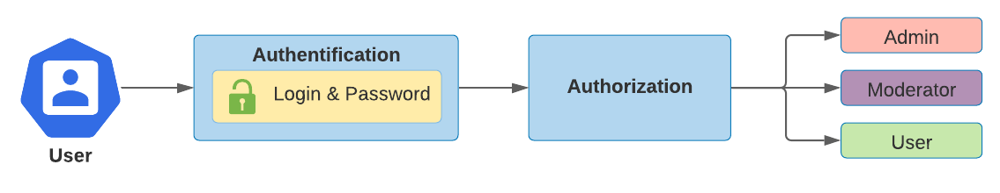

# Spring Security
## Определение `Spring Security`
`Spring Security` - это фреймворк, который обеспечивает аутентификацию, авторизацию и защиту от распространенных атак.

`Spring Security` это Java/JavaEE framework, предоставляющий механизмы построения систем аутентификации и авторизации, а также другие возможности обеспечения безопасности.

`Spring Security` - это де-факто стандарт защиты приложений на основе Spring.

## Аутентификация vs Авторизация


Сначала выполняется `аутентификация`, потом - `авторизация`.

### Аутентификация
`Аутентификация` - это то, как мы проверяем личность того, кто пытается получить доступ к определенному ресурсу. Обычный способ аутентификации пользователей - требовать от пользователя ввода имени пользователя и пароля. После выполнения аутентификации мы узнаем личность и можем выполнить авторизацию.

Источник - [документация Spring Security](https://docs.spring.io/spring-security/reference/features/authentication/index.html).

### Авторизация
`Авторизация` определяет, кому разрешен доступ к определенному ресурсу на основе прав (администратор, модератор, обычный пользователь). 

Spring Security поддерживает авторизацию на основе запросов и авторизацию на основе методов. 

Источник - [документация Spring Security](https://docs.spring.io/spring-security/reference/features/authorization/index.html).

### Как работает аутентификация и авторизация
> Открываем браузер, заходим на `http://localhost:8080/login`, открываем `Инспектор страницы` -> вкладка `Network` и смотрим там следующее
1. При успешной аутентификации, пользователю приходит HTTP Response (ответ), у которого в HTTP заголовке с именем `Response Headers` есть поле `Set-Cookie` со значением `JSESSIONID-XXXXXXXXXXXXXXXX`.
2. При выполнении пользователем любого HTTP запроса в HTTP заголовке с именем `Request Headers` есть поле `Cookie`, внтури которого содержится тот самый `JSESSIONID-XXXXXXXXXXXXXXXX`
3. На основании прав доступа для данного `JSESSIONID-XXXXXXXXXXXXXXXX` и определяеются возможности пользователя.

#### Типы аутентификации
#### 1.1 Аутентификация - in memory 
In memory аутентификация - это когда пользователи хранятся в приложении, например в `ArrayList<User> users`.

```java
@Bean
@Override
protected UserDetailsService userDetailsService() {
   return new InMemoryUserDetailsManager(
      User.builder()
         .username(ADMIN.name().toLowerCase())
         .password(passwordEncoder().encode(ADMIN.name().toLowerCase()))
         .authorities(ADMIN.getAuthorities())
         .build(),

      User.builder()
         .username(USER.name().toLowerCase())
         .password(passwordEncoder().encode(USER.name().toLowerCase()))
         .authorities(USER.getAuthorities())
         .build()
   );
}

@Bean
protected PasswordEncoder passwordEncoder() {
   return new BCryptPasswordEncoder(12);
}
```

После создания пользователя таки образом, в консоли в логах мы больше не увидим сгенерированного пароля для пользователя, которым является по умолчанию пользователь с логином `user`.

#### 1.2 Аутентификация - с помощью базы данных
Аутентификация с помощью БД осуществляется с помощью `JDBC`.

Для начала создается Bean класса `JdbcUserDetailsManager`:
```java
@Bean
public JdbcUserDetailsManager userDetailsManager() {
}
```

Т.к. классу `JdbcUserDetailsManager` необходимо будет взаимодействовать с нашей БД, то ему нужна информация о подключении к данной БД, а это: пользователь, пароль, тип БД и другие настройки. Данные настройки знает бин интерфейса `DataSource` из пакета `javax.sql`, который и необходимо передать как аргумент метода:
```java
@Bean
public JdbcUserDetailsManager userDetailsManager(DataSource dataSource) {
}
```

Теперь мы можем:
1. Либо использовать данные пользователей, которые уже существуют в БД
2. Создать пользователей в Java коде, которые будут создаваться в БД автоматически при каждом запуске приложения (полезно при тестах)

Рассмотрим второй вариант:
```java
@Bean
public JdbcUserDetailsManager userDetailsManager(DataSource dataSource) {
   UserDetails admin = User.builder()
                .username(ADMIN.name().toLowerCase())
                .password(passwordEncoder().encode(ADMIN.name().toLowerCase()))
                .authorities(ADMIN.getAuthorities())
                .build();
   UserDetails user = User.builder()
                .username(USER.name().toLowerCase())
                .password(passwordEncoder().encode(USER.name().toLowerCase()))
                .authorities(USER.getAuthorities())
                .build();

   JdbcUserDetailsManager userDetailsManager = new JdbcUserDetailsManager(dataSource);
   userDetailsManager.createUser(admin);
   userDetailsManager.createUser(user);

   return userDetailsManager;
}
```

Но возникает вопрос, а в какую таблицу БД будут сохраняться данные пользователи? Нужно создать таблицу в БД с соответствующими полями.

## Роли и `authorities` пользователя (важно!)
При присвоении роли пользователю **необходимо** указывать роль с префиксом `ROLE_`, например `ROLE_USER` или `ROLE_ADMINISTRATOR`. И в базу данных необходимо записывать роль **с префиксом** `ROLE_`.

Просто так `USER` или `ADMINISTRATOR` - это неверно!

А вот при указании доступа к определенным URL на основании прав, префикс `ROLE_` писать **не нужно**. Если указать, при компиляции выбросится исключение.

## Как подключить Spring Security
1. Добавляем зависимость:
   ```xml
   <dependencies>
      <dependency>
         <groupId>org.springframework.boot</groupId>
         <artifactId>spring-boot-starter-security</artifactId>
      </dependency>
   </dependencies>
   ```
2. Добавляется класс `ServletInitializer.class` в одном пакете с `ApplicationRunner.class`:
   ```java
   public class ServletInitializer extends SpringBootServletInitializer {

      @Override
      protected SpringApplicationBuilder configure(SpringApplicationBuilder application) {
         return application.sources(Module4Application.class);
      }

   }
   ```

Источник - [документация Spring Security](https://docs.spring.io/spring-security/reference/getting-spring-security.html#getting-maven-boot).

## Немного внутренней работы Spring Security
При подключении Spring Security без дополнительных настроек, Spring Security уже защищает вызовы методов, так как заработала конфигурация — `SpringBootWebSecurityConfiguration` поставляемая Spring Boot.

В JavaDoc класса `SpringBootWebSecurityConfiguration` сказано:
> Если пользователь указывает свой собственный bean-компонент WebSecurityConfigurerAdapter или SecurityFilterChain, это (дефолтные настройки) полностью отключается, и пользователи должны указать все маппинги, которые они хотят настроить как часть настраиваемой конфигурации безопасности. 

`SpringBootWebSecurityConfiguration` внутри выглядит совсем просто:
```java
@Bean
@Order(SecurityProperties.BASIC_AUTH_ORDER)
SecurityFilterChain defaultSecurityFilterChain(HttpSecurity http) throws Exception {
	http.authorizeRequests().anyRequest().authenticated().and().formLogin().and().httpBasic();

	return http.build();
}
```

Можно немного настроить Spring Security через `application.properties`, согласно [документации по Spring Security](https://docs.spring.io/spring-boot/docs/current/reference/html/application-properties.html#application-properties.security).

## Пошагово
## 1. `@EnableWebSecurity` + `WebSecurityConfigurerAdapter.class`
### 1.1 `@EnableWebSecurity`
Первым делом необходимо добавить аннотацию `@EnableWebSecurity`. Аннотацию `@Configuration` добавлять не нужно, т.к. данная аннотация уже содержится внутри `@EnableWebSecurity`:
```java
@EnableWebSecurity
public class SecurityConfiguration {
   ...
}
```
### 1.2 `WebSecurityConfigurerAdapter.class`
Данее, созданный на предыдущем шаге класс `SecurityConfiguration` необходимо расширить от класса `WebSecurityConfigurerAdapter`:
`@EnableWebSecurity`:
```java
@EnableWebSecurity
public class SecurityConfiguration extends WebSecurityConfigurerAdapter {
   ...
}
```

### 1.3 Переопределяем метод `configure(HttpSecurity http)`
Далее переопределяем метод `configure(HttpSecurity http)`, в котором можно настраивать такие параметры как:
1. К каким методам у пользователей есть доступ
2. Где требуются роли\права доступа
3. Что должно происходить, когда пользователь делает `logout`
4. И многие другие вещи, которые на данном этапе рассматриваться не будут

```java
@EnableWebSecurity
public class SecurityConfiguration extends WebSecurityConfigurerAdapter {
   
   @Override
   protected void configure(HttpSecurity http) throws Exception {
      ...
   }
}
```

### 1.4 Класс `HttpSecurity`
Класс `HttpSecurity` находится в пакете `org.springframework.security.config.annotation.web.builders`.

Рассмотрим некоторые методы класса `HttpSecurity`:

`authorizeRequests()` - говорит о том, что все запросы должы проходить через `Spring Security`. 

`permitAll()` - любой желающий может получить доступ к конечной точке **без аутентификации**. 

`antMathers()` - задает URL маппинг для пользователя.

`authenticacted()` - дает доступ к указанному URL (задается с помощью `antMathers()`) только пользователям, прошедшим **аутентификацию**.

`.anyRequest().denyAll()` - Любому URL-адресу, который еще не был указан, отказано в доступе  
Источник - [документация Spring Secuirty](https://docs.spring.io/spring-security/reference/servlet/authorization/authorize-requests.html).

`.httpBasic()` - возможно выполнять запросы без JWT, а просто по `login` и `password`.

#### Изменение URL пути для авторизации
По умолчанию Spring установил URL для авторизации `http://localhost:8080/login`. Что его изменить, необходимо:
```java
.fromLogin().loginProcessingUrl("/abra")
```
Теперь форма для ввода `username` и `password` уже будет отображаться по адресу `http://localhost:8080/abra`.

#### Изменение пути переадресации при успешной авторизации
По умолчанию Spring, в случае успешной авторизации, перенаправит вас на ту страницу, из которой вы попали на форму для ввода `username` и `password`.

Чтобы изменить это поведение, необходимо:
```java
.fromLogin().successForwardUrl("/next-page")
```

Теперь, в случае успешной авторизации, приложение перенаправит вас на страницу `http://localhost:8080/next-page`.

#### Стандартный logout
Для того, чтобы выполнить `logout`, необходимо перейти по пути `http://localhost:8080/logout`, после чего откроется страница с кнопкой `Log Out`.

# Principal
`Principal` содержит в себе **минимальную** информацию о пользователе, которая хранится в контексте Spring Security.

Для того, чтобы использовать `Principal`, его необходимо указать в контроллере в качестве параметра метода, например:
```java
@GetMapping("/go")
public String getPage(Principal principal) {
   return "Hello, " + principal.getName();
}
```

# HttpSecurity
```java
@EnableWebSecurity
public class SecurityConfig extends WebSecurityConfigurerAdapter {
    @Override
    protected void configure(HttpSecurity http) throws Exception {
        http
               // Механизм от защиты CSFR угрозы
               .csrf().disable()
               .authorizeRequests()
               // доступ к "/" имеют все
                .antMatchers("/").permitAll()

               // по аналогии
                .antMatchers(HttpMethod.GET, "/api/**").hasAnyRole(Role.ADMIN.name(), Role.USER.name())
                .antMatchers(HttpMethod.POST, "/api/**").hasRole(Role.ADMIN.name())
                .antMatchers(HttpMethod.DELETE, "/api/**").hasRole(Role.ADMIN.name())

               // Любой запрос должен быть аутентифицирован
                .anyRequest()
                .authenticated()
    }
}
```
> Если не отключить `CSRF` командой `.csrf().disable()`, то **авторизованный** пользователь при выполнении `POST` запроса получит `HTTP Error 403`.

## Методы `HttpSecurity`
### Метод `.authorizeRequests()`

`.authorizeRequests()` - ограничивает доступ на основе запроса `HttpServletRequest` с помощью `RequestMatcher`. 

`RequestMatcher` - если посмотреть исходный код, то это простая стратегия для фильтрации `HttpServletRequest`, чтобы запрос соответствовал определенным условиям.

### Метод `.anyRequest().authenticated()`
Любой запрос может быть выполнен только пользователям, прошедшим аутентификацию.

# Авторизованный доступ
Виды доступов:
1. На основе ролей
2. На основе прав (`Permission` - разрешение)

Например, роли `ADMIN` даются права на чтение (методы `GET`), на запись (методы `POST`), на удаление (методы `DELETE`). А вот роли `USER` дается право только на чтение. 

# UserDetails
## Для чего нужен `UserDetails`
`UserDetails` - это интерфейс, который находится в пакете `org.springframework.security.core.userdetails`. 

Представим ситуацию. В мире существует много проектов, внутри которых у пользователя может быть огромное количество полей и все они будут отличаться от проекта к проекту. Где-то нужно добавить поле для дня рождения, где-то указать наличие детей, в каком-то проекте нужно указать пол человека и т.д. Так вот это всё не интересно для Spring Security. Для Spring Security важны только определенные поля, которые будут общими у всех в любом проекте и это:
1. `Username` или `login`
2. `Password`
3. Права доступа
4. Аккаутн забанен или нет

И вот это всё и описыват интерфейс `UserDetails`:
```java
package org.springframework.security.core.userdetails;

import java.io.Serializable;
import java.util.Collection;
import org.springframework.security.core.GrantedAuthority;

public interface UserDetails extends Serializable {
    Collection<? extends GrantedAuthority> getAuthorities();   // Права доступа

    String getPassword();

    String getUsername();

    boolean isAccountNonExpired();

    boolean isAccountNonLocked();

    boolean isCredentialsNonExpired();

    boolean isEnabled();
}
```

## Методы интерфейса `UserDetails`
Имя интерфейса: `UserDetails`
Расположение: `org.springframework.security.core.userdetails`

Данный интерфейс содержит методы:
```java
@Override
public Collection<? extends GrantedAuthority> getAuthorities() {
    return Collections.singletonList(new SimpleGrantedAuthority(role.name()));
}

@Override
public String getPassword() {
    return null;
}

@Override
public String getUsername() {
    return this.login;
}

@Override
public boolean isAccountNonExpired() {
    return false;
}

@Override
public boolean isAccountNonLocked() {
    return false;
}

@Override
public boolean isCredentialsNonExpired() {
    return false;
}

@Override
public boolean isEnabled() {
    return false;
}
```

Рассмотрим каждый метод в отдельности:
1. Если метод `isAccountNonLocked()` возвращает `false`, то после ввода логина и пароля пользователь получит предупреждение `User is locked`.
2. Если метод `isEnabled()` возвращает `false`, то после ввода логина и пароля пользователь получит предупреждение `User is disable`.
3. Если метод `isAccountNonExpired()` возвращает `false`, то после ввода логина и пароля пользователь получит предупреждение `User account has expired`.
4. Если метод `isCredentialsNonExpired()` возвращает `false`, то после ввода логина и пароля пользователь получит предупреждение `Bad credentials`.
5. Если метод `getPassword()` возвращает `null`, то после ввода логина и пароля в консоли получит предупреждение `Empty encoded password` (см. ниже). Нужно просто вернуть поле пароля:
   ```java
   @Override
    public String getPassword() {
        return this.passwordEncoded;
    }
	```

## Узнать список Security фильтров
У аннотации `@EnableWebSecurity` выставить флаг `@EnableWebSecurity(debug = true)` таким образом:
```java
@EnableWebSecurity(debug = true)
public class EsmSecurityConfiguration extends WebSecurityConfigurerAdapter {
   ...
}
```

И тогда в консоли после попытки авторизации мы получим список фильтров, через которые проходит процесс авторизации:
```text
Security filter chain: [
  WebAsyncManagerIntegrationFilter
  SecurityContextPersistenceFilter
  HeaderWriterFilter
  LogoutFilter
  UsernamePasswordAuthenticationFilter
  DefaultLoginPageGeneratingFilter
  DefaultLogoutPageGeneratingFilter
  RequestCacheAwareFilter
  SecurityContextHolderAwareRequestFilter
  AnonymousAuthenticationFilter
  SessionManagementFilter
  ExceptionTranslationFilter
  FilterSecurityInterceptor
]
```

## Для чего сущности `User` необходимо имплементировать интерфейс `UserDetails`
Т.к. классу `UserServiceImpl` необходимо имплементировать интерфейс `UserDetailsService`, который находится в пакете `org.springframework.security.core.userdetails`. Данный интерфейс является функциональным, т.к. внутри себя содержит только один метод:
```java
public interface UserDetailsService {

	UserDetails loadUserByUsername(String username) throws UsernameNotFoundException;
}

```
Следовательно, наш сервисный класс `UserServiceImpl` должен реализовать поведение для данного единственного метода. Данный метод возвращает объект типа `UserDetails`, поэтому мы и должны имплементировать интерфейс `UserDetails` для нашей сущности `User`.

# @PreAuthorize
Данная аннотация используется в контроллере над теми методами, для которых необходимо задать контроль в зависимости от роли\прав пользователя.

Сперва необходимо добавить аннотацию `@EnableGlobalMethodSecurity`:
```java
@Configuration
@EnableWebSecurity
@EnableGlobalMethodSecurity(prePostEnabled = true)
public class SecurityConfig extends WebSecurityConfigurerAdapter {
   ...
}
```

Далее необходимо удалить все методы `.antMatchers(...)` в методе:
```java
@Override
protected void configure(HttpSecurity http) throws Exception {
   ...
}
```

Финальный результат метода `configure(HttpSecurity http)` будет иметь вид:
```java
@Override
    protected void configure(HttpSecurity http) throws Exception {
        http.csrf().disable()
                .authorizeRequests()
                .antMatchers("/").permitAll()
                .anyRequest()
                .authenticated()
                .and()
                .httpBasic();
    }
```

В завершающем шаге, необходимо в контроллере над нужными нам методами использовать аннотацию `@PreAuthorize("hasAuthority('developers:write')")`:
```java
@GetMapping("/{id}")
@PreAuthorize("hasAuthority('developers:read')")
public Developer findById(@PathVariable Long id) {
   return developers.stream()
            .filter(developer -> developer.getId().equals(id))
            .findFirst()
            .orElse(null);
}

@PostMapping
@PreAuthorize("hasAuthority('developers:write')")
public Developer create(@RequestBody Developer developer) {
   this.developers.add(developer);
   return developer;
}
```

# Logout
По-умолчанию операция `logout` (выйти) для пользователя осуществляется с помощью метода `GET`, но этот метод для данной операции не рекомендуется (почему? написано вроде как в документации), лучше использовать метод `POST`.

# Spring Security + `DaoAuthenticationProvider`
```java
package com.epam.esm.controller.configuration;

import com.epam.esm.model.entity.User;
import org.springframework.context.annotation.Bean;
import org.springframework.security.authentication.dao.DaoAuthenticationProvider;
import org.springframework.security.config.annotation.authentication.builders.AuthenticationManagerBuilder;
import org.springframework.security.config.annotation.web.builders.HttpSecurity;
import org.springframework.security.config.annotation.web.configuration.EnableWebSecurity;
import org.springframework.security.config.annotation.web.configuration.WebSecurityConfigurerAdapter;
import org.springframework.security.core.userdetails.UserDetailsService;
import org.springframework.security.crypto.bcrypt.BCryptPasswordEncoder;
import org.springframework.security.crypto.password.PasswordEncoder;

import javax.annotation.Resource;

@EnableWebSecurity(debug = true)
public class SecurityConfiguration extends WebSecurityConfigurerAdapter {
    @Resource
    private UserDetailsService userDetailsService;  // for UserServiceImpl

    @Override
    protected void configure(HttpSecurity http) throws Exception {
        http.csrf().disable()
                .authorizeRequests()
                .antMatchers("/auth/admin-profile").hasRole("ADMINISTRATOR")
                .antMatchers("/auth/read-profile").hasRole("USER")
                .and()
                .formLogin()
                .usernameParameter(User.DefaultUsernameParameter.LOGIN.name().toLowerCase()) // default - username;  let my custom EsmSecurityConfiguration know that "login" is a principal parameter now
                .and()
                .logout().logoutSuccessUrl("/auth/go");
    }

    @Bean
    protected PasswordEncoder passwordEncoder() {
        return new BCryptPasswordEncoder(12);
    }

    /**
     * Used to link the Spring application with the <code>user</code> table in the database.
     * Also uses bean <code>BCrypt password encoder</code> to convert passwords.
     * <br>
     * Checks the existence of a user in the database. If user exists, then it will put the user data in the Spring Security Context.
     *
     * @return DaoAuthenticationProvider
     * @see org.springframework.security.crypto.bcrypt.BCryptPasswordEncoder
     */
    @Bean
    public DaoAuthenticationProvider daoAuthenticationProvider() {
        DaoAuthenticationProvider authenticationProvider = new DaoAuthenticationProvider();
        authenticationProvider.setPasswordEncoder(passwordEncoder());
        authenticationProvider.setUserDetailsService(userDetailsService);
        return authenticationProvider;
    }

    @Override
    protected void configure(AuthenticationManagerBuilder auth) throws Exception {
        auth.authenticationProvider(daoAuthenticationProvider());
    }
}

```

# Spring Security + JWT
```java
package com.epam.esm.controller.configuration;

import com.epam.esm.model.entity.User;
import com.epam.esm.model.util.UrlMapping;
import org.springframework.context.annotation.Bean;
import org.springframework.security.authentication.AuthenticationManager;
import org.springframework.security.config.annotation.web.builders.HttpSecurity;
import org.springframework.security.config.annotation.web.configuration.EnableWebSecurity;
import org.springframework.security.config.annotation.web.configuration.WebSecurityConfigurerAdapter;
import org.springframework.security.config.http.SessionCreationPolicy;
import org.springframework.security.crypto.bcrypt.BCryptPasswordEncoder;
import org.springframework.security.crypto.password.PasswordEncoder;

import static com.epam.esm.model.entity.User.Role.ROLE_ADMINISTRATOR;
import static com.epam.esm.model.entity.User.Role.ROLE_USER;

@EnableWebSecurity(debug = true)
public class SecurityConfiguration extends WebSecurityConfigurerAdapter {
    private final JwtConfiguration jwtConfiguration;

    public SecurityConfiguration(JwtConfiguration jwtConfiguration) {
        this.jwtConfiguration = jwtConfiguration;
    }

    @Override
    protected void configure(HttpSecurity http) throws Exception {
        http.csrf().disable()
                .sessionManagement().sessionCreationPolicy(SessionCreationPolicy.STATELESS)
                .and()
                .authorizeRequests()
                .antMatchers(UrlMapping.AUTHENTICATION + UrlMapping.SIGN_UP).permitAll()
                .antMatchers("/auth/admin-profile").hasRole(ROLE_ADMINISTRATOR.name())
                .antMatchers("/auth/read-profile").hasRole(ROLE_USER.name())
                .and()
                .formLogin()
                .usernameParameter(User.DefaultUsernameParameter.LOGIN.name().toLowerCase()) // default - username;  let my custom EsmSecurityConfiguration know that "login" is a principal parameter now
                .and()
                .logout().logoutSuccessUrl("/auth/go")
                .and()
                .apply(jwtConfiguration);
    }

    @Bean
    protected PasswordEncoder passwordEncoder() {
        return new BCryptPasswordEncoder(12);
    }

    @Bean
    @Override
    public AuthenticationManager authenticationManagerBean() throws Exception {
        return super.authenticationManagerBean();
    }
}
```

## Почему `BCryptPasswordEncoder` генерирует разные хэши для одинакового значения
Рассмотрим встроенный `BcryptPasswordEncoder` в `Spring`.

Создание бина `BcryptPasswordEncoder` выглядит следующим образом:
```java
@Bean
    protected PasswordEncoder passwordEncoder() {
        return new BCryptPasswordEncoder(12);
}
```

При попытке зашифровать пароль, `passwordEncoder` будет каждый раз выдавать разные значения, т.к. всегда используется разная "соль".
```java
passwordEncoder.encode("password")
```

Чтобы сравнивать пароли, необходимо использовать метод `matches()`:
```java
// Пароль, который нужно сравнивать на равенство с паролем из БД
String password = "abra-kadabra";

// Зашифрованный пароль из БД
String passwordEncoded = "$2a$12$Bi0YMOj4YEExhtb1jAqZf.8HuxJFodGjjOvrpyxDAdxNTWKiFTtve";

// Правильно
boolean isEqueal = passwordEncoder.matches(password, passwordEncoded);

// Неправильно
String encoded = passwordEncoder.encode(password);
boolean isEqueal = passwordEncoder.matches(encoded, passwordEncoded);
```


# Полезности
## Как создать и подключить собственную конфигурацию
Чтобы создать конфигурацию, необходимо создать Java класс, который будет расширять `extends SecurityConfigurerAdapter<DefaultSecurityFilterChain, HttpSecurity>`:
```java
@Component
public class JwtConfiguration extends SecurityConfigurerAdapter<DefaultSecurityFilterChain, HttpSecurity> {
    private final JwtFilter jwtFilter;

    public JwtConfiguration(JwtFilter jwtFilter) {
        this.jwtFilter = jwtFilter;
    }

    @Override
    public void configure(HttpSecurity builder) throws Exception {
        builder.addFilterBefore(jwtFilter, UsernamePasswordAuthenticationFilter.class);
    }
}
```
Внутри данного класса необходимо переопределить метод `configure(...)`, внтури которого, как и в главном конфигурационном классе, прописывать конфигурацию.

Потом в главном конфигурационном Java классе, который расширяет `extends WebSecurityConfigurerAdapter`, подключаем ранее созданный конфигурационный класс с помощью метода `apply(...)` класса `HttpSecurity`:
```java
@EnableWebSecurity(debug = true)
public class SecurityConfiguration extends WebSecurityConfigurerAdapter {
    @Override
    protected void configure(HttpSecurity http) throws Exception {
        http.apply(jwtConfiguration);
    }
}
```

## `@PreAuthorize` и `@PostAuthorize`
Для того, что была возможность использовать данные аннотации, необходимо использовать `@EnableGlobalMethodSecurity(prePostEnabled = true)` в нашем  классе, отвечающем на настройки Spring Security.

Например есть метод с аннотацией:
```java
@PreAuthorize("@userAccessVerification.verifyAuthorizationUser(#userId)")
```
Аннотация `@PreAuthorize` проверяет выражение в скобках перед вводом метода, тогда как аннотация `@PostAuthorize` проверяет его после выполнения метода и может изменить результат. 

`Выражение в скобках` задается с помощью [Spring Expression Language (SEL)](https://www.baeldung.com/spring-expression-language).

# Глава 2 - Обработка исключений
Обработка запросов Spring Security происходит в цепочке фильтров до вызова сервлета диспетчера, поэтому он ничего не знает об обработчиках исключений Spring MVC и фактически может использоваться без Spring MVC. Поэтому с помощью аннотации `@ExceptionHandler(AccessDeniedException.class)` исключения аутентификации и авторизации словить нельзя.

Spring Security предоставляет компонент, который по умолчанию обрабатывает сбои **аутентификации**.

Однако нередко мы оказываемся в ситуации, когда поведения по умолчанию недостаточно для удовлетворения требований.

Если это так, мы можем создать наш собственный компонент и обеспечить желаемое поведение, реализовав интерфейс `AuthenticationFailureHandler`: 
```java
public class AuthenticationExceptionHandler implements AuthenticationFailureHandler {

    @Override
    public void onAuthenticationFailure(HttpServletRequest request,
                                        HttpServletResponse response,
                                        AuthenticationException exception) throws IOException, ServletException {...}
}
```

Далее неоходимо сконфигурировать наше приложение на обработку исключений с помощью созданного выше класса.