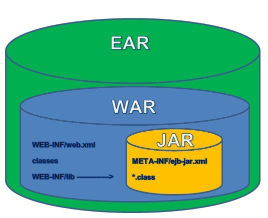

# Maven

## Отличие `jar`, `war` и `pom`
Внутри `pom.xml` можно увидеть такие строки:
```xml
<packaging>pom</packaging>
<packaging>jar</packaging>
<packaging>war</packaging>
```

`jar` и `war` – это расширения платформо-независимых файлов-архивов Java-приложения. Кроме них есть еще третий формат, `ear`. Все эти форматы – на самом деле просто `zip`-архивы с классами и другими частями приложения. 

`JAR` – Java Archive. Содержит файлы классов, ресурсы, зависимые библиотеки, и другие необходимые для приложения файлы. Может содержать точку входа, и использоваться как цель для исполнения команды java.

`WAR` – Web Archive. Технически имеет ту же структуру, но другую роль – архив JavaEE web-компонента. Обычно содержит jar-ы с реализацией, JSP, статические файлы фронт-энда, и мета-информацию для сервлет-контейнера (web.xml). В основном используется как деплоймент web-приложения в сервлет-контейнер. С приходом Servlet API 3.0 и embedded-контейнеров, всё больше становится принято запаковывать и web-компоненты в самодостаточные jar (Лозунг Spring Boot: Make jar, not war).

