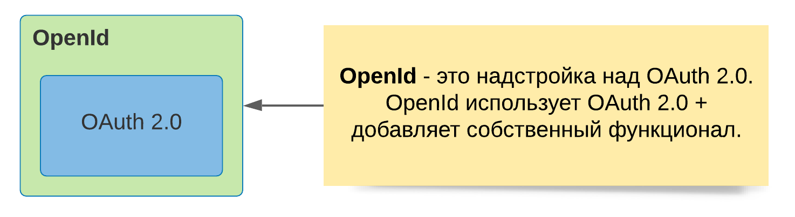

# OAuth2.0

### OAuth2.0 = Авторизация (не аутентификация)

## Определение `OAuth`
`OAuth` - это открытый протокол (схема) **авторизации** (не аутентификацию), который позволяет предоставить третьей стороне ограниченный доступ к защищенным ресурсам без необходимости передачи третьей стороне логина и пароля.

## Определение `OpenId Connect`
`OpenId Connect` - является надстройкой над `OAuth 2.0`.

### Отличие `OpenID` и `OAuth`
`OpenID` предназначен для **аутентификации** — то есть для того, чтобы понять, что этот конкретный пользователь является тем, кем представляется. Например, с помощью OpenID некий сервис Ололо может понять, что зашедший туда пользователь, это именно Рома Новиков с Mail.Ru. При следующей аутентификации Ололо сможет его опять узнать и понять, что, это тот же Рома, что и в прошлый раз.

`OAuth` же является протоколом **авторизации**, то есть позволяет выдать права на действия, которые сам Ололо сможет производить в Mail.Ru от лица Ромы. При этом Рома после авторизации может вообще не участвовать в процессе выполнения действий, например, Ололо сможет самостоятельно заливать фотографии на Ромин аккаунт. 

### Почему `OAuth2.0`, а не `OAuth`
Стандарты аутентификации и авторизации разрабатывает фирма `IETF`, на сайте которой `OAuth` является `Depricateed`.

## Ключевые понятия

`Resource Owner` - это обычный человек либо сервер.

## Общая схема из реальной жизни


`Client` - этот тот, кто хочет получить данные.

## Пошагово
### Шаг 1: Пользователь авторизует приложение
Ситуация - человек не залогинен.

Надо нажать на кнопку авторизации на сайте.

Например:
> Приложение “Thedropletbook App” запрашивает доступ на чтение к аккаунту “manicas@digitalocean.com”.

### Шаг 2: Приложение получает код авторизации
Если пользователь выбирает “Авторизовать приложение”, сервис перенаправляет пользовательский браузер по URL перенаправления (redirect URL), который был задан на этапе регистрации клиента (вместе с кодом авторизации). Ссылка будет выглядеть похожим образом (в данном примере приложение называется “dropletbook.com”):

```http
https://dropletbook.com/callback?code=AUTHORIZATION_CODE
```

### Шаг 3: Приложение запрашивает токен доступа
Приложение запрашивает токен доступа у API путём отправки **авторизационного кода и аутентификационной информации (включая секрет клиента)** сервису. Ниже представлен пример POST-запроса для получения токена DigitalOcean:
```http
https://cloud.digitalocean.com/v1/oauth/token?client_id=CLIENT_ID&client_secret=CLIENT_SECRET&grant_type=authorization_code&code=AUTHORIZATION_CODE&redirect_uri=CALLBACK_URL
```

### Шаг 4: Приложение получает токен доступа
Если авторизация прошла успешно, API возвращает токен доступа (а также, опционально, токен для обновления токена доступа - refresh token). Весь ответ сервера может выглядеть следующим образом:
```json
{
    "access_token":"ACCESS_TOKEN",
    "token_type":"bearer",
    "expires_in":2592000,
    "refresh_token":"REFRESH_TOKEN",
    "scope":"read",
    "uid":100101,
    "info": {
        "name":"Mark E. Mark",
        "email":"mark@thefunkybunch.com"
        }
    }
```

Теперь приложение авторизовано! Оно может использовать токен для доступа к пользовательскому аккаунту через API сервиса с заданными ограничениями доступа до тех пор, пока не истечёт срок действия токена или токен не будет отозван. Если был создан токен для обновления токена доступа, **он может быть использован для получения новых токенов доступа**, когда истечёт срок действия старого токена.

### Что передается в Http Header
`client_id=CLIENT_ID` - идентификатор клиента приложения (с помощью этого идентификатора API понимает, какое приложение запрашивает доступ).
`redirect_uri=CALLBACK_URL` - URL, на который сервис перенаправит пользовательского агент (браузер) после выдачи авторизационного кода.
`response_type=code` - указывает на то, что приложение запрашивает доступ с помощью кода авторизации.  
`scope=read` - задаёт уровень доступа приложения (в данном случае - доступ на чтение).

## Типы токенов


`Refresh token` используется для обновления `Access token`.

### 1. Access Token
1. Ограниченное время жизни (1 час по умолчанию). Время жизни можно изменить.
2. Можно отозвать
3. Из Access Token'a нельзя получить `login` и `password` (нельзя распарсить)

#### 1.1 Способы получения Access Token:
1. По аторизационному коду (Authorization Code Grant)
2. Неявно (Implicit Grant)
3. По `login` и `password` пользователя (Resource Owner Password Credential) - не рекомендуется использовать
4. По данным клиента (Client Credentials Grant)

##### 1.1.1 Схема - по аторизационному коду (Authorization Code Grant)
Этап 1:

Этап 2:

Этап 3:

Тут есть небольшой минус - на третьем этапе (третье изображение) `Authorization Server` возвращает в браузер строку, в которой присутствует `code`, который может посмотреть злоумышленник. Чтобы это нивелировать, делают данный `code` одноразовым.

Этап 4:


##### 1.1.2 Схема - неявно (Implicit Grant)


##### 1.1.3 Схема - по `login` и `password` пользователя (Resource Owner Password Credential)

Не рекомендуется использовать данную схему (об этом пишет создатель OAuth на официальном сайте), т.к. `login` и `password` напрямую передаются клиенту, что небезопасно. `Login` и `password` необходимо передавать только авторизационному ресурсу `Authorization Server`.

##### 1.1.4 Схема - по данным клиента (Client Credentials Grant)


### Refresh Token
Используется, чтобы обновить `Access Token`.

Это не автоматическая операция, необходимо явно выполнить запрос.

# OpenId Connect


OpenId Connect предназначен для решения проблем с **аутентификацией**.

## Общая схема


# Официальная документация
Функция входа с помощью OAuth 2.0 предоставляет приложению возможность, позволяющую пользователям входить в приложение, используя свою существующую учетную запись у поставщика OAuth 2.0 (например, GitHub) или OpenID Connect 1.0 (например, Google). 

OAuth 2.0 Login реализует варианты использования: «Войти через Google» или «Войти через GitHub». 

Вход в систему OAuth 2.0 осуществляется с помощью предоставления кода **авторизации** (`Authorization Code Grant`), как указано в OAuth 2.0 Authorization Framework и OpenID Connect Core 1.0. 

[Исчтоник - официальная документация Spring Security](https://docs.spring.io/spring-security/reference/reactive/oauth2/login/index.html)