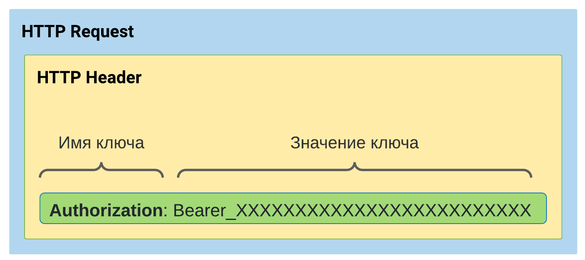
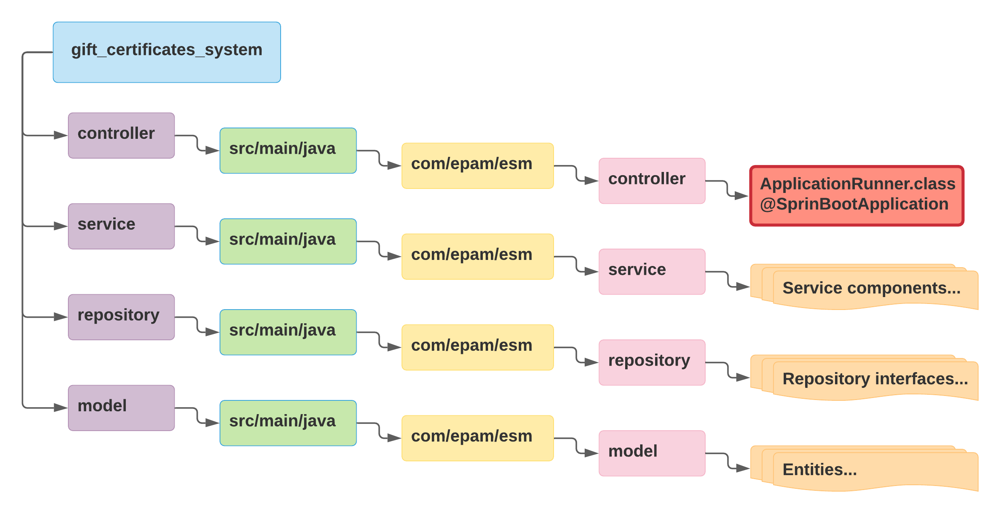
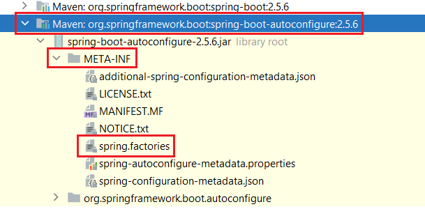

## Зачем создавать класс `RelationId.class`

Если его не создавать, то в интерфейсе `GiftCertificateToTagRelationRepository` возникнет ошибка при компиляции:
```log
2021-11-23 17:58:34.922  WARN 12528 --- [           main] ConfigServletWebServerApplicationContext : Exception encountered during context initialization - cancelling refresh attempt: org.springframework.beans.factory.BeanCreationException: Error creating bean with name 'giftCertificateToTagRelationRepository' defined in com.epam.esm.repository.GiftCertificateToTagRelationRepository defined in @EnableJpaRepositories declared on JpaRepositoriesRegistrar.EnableJpaRepositoriesConfiguration: Invocation of init method failed; nested exception is java.lang.IllegalArgumentException: This class [class com.epam.esm.entity.GiftCertificateToTagRelation] does not define an IdClass
```

Эта ситуация подпадает под пункт [2.4.1 «Первичные ключи, соответствующие производным идентификаторам» спецификации JPA 2.1.](https://download.oracle.com/otndocs/jcp/persistence-2_1-fr-eval-spec/index.html)

Идентификаторы могут быть реализованы с помощью `@IdClass` или `@EmbeddedId`, но не обоих одновременно (согласно [документации](https://docs.jboss.org/hibernate/orm/5.4/userguide/html_single/Hibernate_User_Guide.html#identifiers-composite-nonaggregated)).

При использовании `@IdClass` (пункт 2.4.1.1) необходимо соблюдать требования:
- Атрибут Id в классе сущности и соответствующий атрибут в классе id должны иметь одно и то же имя.


## `@NotNull`
Аннотация `@NotNull` из пакета `org.jetbrains.annotations.NotNull` в интерфейсах Spring Data JPA репозиториев выбрасывает по умолчанию исключение `java.lang.IllegalArgumentException` с сообщением `Entity must not be null!`.


## `@Enumerated(EnumType.STRING)`
**Вопрос:**  
Зачем в классе `User` полю `private Role role` типа `ENUM` добавлять аннотацию `@Enumerated(EnumType.STRING)`?

**Ответ:**  
Без аннотации `@Enumerated(EnumType.STRING)` после ввода пользователем логина и пароля произойдет вызов в `UserServiceImpl` метода:
```java
public UserDetails loadUserByUsername(String login) throws UsernameNotFoundException {...}
```
После чего, Hibernate, на основе имени данного метода, создаст SQL запрос:
```sql
select u.id               as id1_4_,
       u.first_name       as first_na2_4_,
       u.last_name        as last_nam3_4_,
       u.login            as login4_4_,
       u.password_encoded as password5_4_,
       u.role             as role6_4_
from user u
where u.login = ?
```

И мы получим исключение:
```log
2021-11-28 17:30:18.593 ERROR 11236 --- [nio-8080-exec-1] w.a.UsernamePasswordAuthenticationFilter : An internal error occurred while trying to authenticate the user.

org.springframework.security.authentication.InternalAuthenticationServiceException: For input string: "ROLE_ADMINISTRATOR"; nested exception is java.lang.NumberFormatException: For input string: "ROLE_ADMINISTRATOR"
```

[Подробней на Baeldung.com](https://www.baeldung.com/jpa-persisting-enums-in-jpa)

# Зачем переопределять метод `configure(AuthenticationManagerBuilder auth)`
Данный метод находится в конфигурационном Java классе:
```java
@EnableWebSecurity(debug = true)
public class EsmSecurityConfiguration extends WebSecurityConfigurerAdapter {...}
```
Выглядит он следующим образом:
```java
@Override
protected void configure(AuthenticationManagerBuilder auth) throws Exception {
    auth.authenticationProvider(daoAuthenticationProvider());
}
```

Чтобы узнать, кто может выступать в качестве `authenticationProvider`, нужно посмотреть исходный код класса `AuthenticationManagerBuilder` в пакете `org.springframework.security.config.annotation.authentication.builders`:
1. `InMemoryUserDetailsManagerConfigurer`
2. `JdbcUserDetailsManagerConfigurer`
3. `DaoAuthenticationConfigurer`
4. `LdapAuthenticationProviderConfigurer`


# JWT
## Зачем переопределять метод `init()` в `EsmJwtProvider`
Метод переопределения выглядит:
```java
@Component
public class EsmJwtProvider {
    private static String SIGNING_KEY = "esm";
    
	@PostConstruct
    protected void init() {
        SIGNING_KEY = Base64.getEncoder()
                .encodeToString(SIGNING_KEY.getBytes(StandardCharsets.UTF_8));
    }
}
```

Зачем переопределять, вроде как написано в [официальной документации по Spring Security](https://docs.spring.io/spring-security/reference/index.html).

## `EsmJwtProdiver`
Мой класс `EsmJwtProvider` содержит метод, возвращающий объект аутентификации:
```java
public Authentication getAuthentication(String toke) {...}
```

Объект `Authentication` уже хранится в контексте (вроде называется `SecurityContextHolder`, но уточнить). Следовательно, нам нужно не заново создавать объект `Authentication`, а нужно достать из контекста:
```java
@Component
public class EsmJwtProvider {
    private final UserDetailsService userDetailsService;
    private static String SIGNING_KEY = "esm";

    public EsmJwtProvider(UserDetailsService userDetailsService) {
        this.userDetailsService = userDetailsService;
    }

	public Authentication getAuthentication(String token) {
        String login = getLoginFromJwt(token);
        UserDetails userDetails = userDetailsService.loadUserByUsername(login);
    }
}
```

В этом методе нам необходимо извлекать `login` из `JWT` и для этого дела создали метод:
```java
public String getLoginFromJwt(String token) {
    return Jwts.parser()
            .setSigningKey(SIGNING_KEY)
            .parseClaimsJws(token)
            .getBody()
            .getSubject();
}
```

## `HttpSecurity.apply(jwtConfiguration)`
```java
@EnableWebSecurity(debug = true)
public class SecurityConfiguration extends WebSecurityConfigurerAdapter {
    private final JwtConfiguration jwtConfiguration;

    public SecurityConfiguration(JwtConfiguration jwtConfiguration) {
        this.jwtConfiguration = jwtConfiguration;
    }

    @Override
    protected void configure(HttpSecurity http) throws Exception {
        http.csrf().disable()
				...
                .and()
                .apply(jwtConfiguration);
    }
```

Говорит о том, что отныне аутентифицировать пользователей нужно на основании созданного нами конфигурационного класса `jwtConfiguration`.

Т.к. мы уже не используем сессии, то необходимо указать:
```java
.sessionManagement().sessionCreationPolicy(SessionCreationPolicy.STATELESS)
```

`SessionCreationPolicy.STATELESS` означает, что объект `HttpSession` на каждого юзера никогда не будет создаваться и не будет использоваться в `SecurityContext` (это указано в JavaDoc к `enum SessionCreationPolicy`, который находится в пакете `org.springframework.security.config.http`).

## `@MappedSuperclass`
Аннотация говорит, что для данного класса не нужна отдельная таблица в БД.

## `usernameParameter(...)`
`UserDetailService` - `org.springframework.security.core.userdetails`
`UsernamePasswordAuthenticationFilter` - `org.springframework.security.web.authentication`

```java
public interface UserDetailsService {
	UserDetails loadUserByUsername(String username) throws UsernameNotFoundException;
}
```

По умолчанию для переменной `username` на странице аутентификации определено такое же значение - `username`. Оно берется не из потолка, а оно прописано в классе `UsernamePasswordAuthenticationFilter` в качестве переменной:
```java
public static final String SPRING_SECURITY_FORM_USERNAME_KEY = "username";
```

А далее ипользуется переменная:
```java
private String usernameParameter = SPRING_SECURITY_FORM_USERNAME_KEY;
```

И дефолтное значение этой переменной можно изменить с помощью метода `usernameParameter(...)` класса `HttpSecurity`, передав в качестве аргумена любое имя:
```java
httpSecurity.formLogin()
        .usernameParameter("email")
        .passwordParameter("passwordEncoded"))
```

## `@NoArgsConstructor(access = AccessLevel.PRIVATE)`

Аннотация `@NoArgsConstructor(access = AccessLevel.PRIVATE)` используется, чтобы явно в классе не прописывать приватный конструктор без аргументов:
```java
// Использования Lombok аннотации
@NoArgsConstructor(access = AccessLevel.PRIVATE)
public final class MessagePropertyKey {...}

// Вместо явного указания приватного конструктора
public final class MessagePropertyKey {	
	private MessagePropertyKey() {
	}
}
```

## Зачем использовать `UserDetails`
Нужно найти пользователя в базе данных и положить его данные (например логин и роль) в `Spring Security контекст`. Но я не могу положить какой попало объект. Спринг будет понимать только объекты из «своего круга», которым и является `UserDetails`.

## Зачем в роли префикс `ROLE_`
Если перейти в реализацию метода `hasRole` класса `HttpSecurity`, то можно увидеть, что `Spring Security` добавляет к имени роли префикс `ROLE_`, если он отсутствует:
```java
// (1) Сначала попадаем в public метод, который вызывает private метод ниже
public ExpressionInterceptUrlRegistry hasRole(String role) {
	return access(ExpressionUrlAuthorizationConfigurer.hasRole(role));
}

// (2) private метод
private static String hasRole(String role) {
	Assert.notNull(role, "role cannot be null");
	Assert.isTrue(!role.startsWith("ROLE_"),
			() -> "role should not start with 'ROLE_' since it is automatically inserted. Got '" + role + "'");
	return "hasRole('ROLE_" + role + "')";
}
```

## Зачем `JWTFilter` реализовывать от `GenericFilterBean`
`GenericFilterBean` - это интерфейс в пакете `org.springframework.web.filter`.

По сути дела, `GenericFilterBean` - это обычная базовая имплементация `javax.servlet.Filter`, который и используется для фильтрации запросов на сервлет. У его есть метод `doFilter(...)`, именно он будет срабатывать при работе фильтра.

## Зачем нужен фильтр `JwtFilter`

#### Где находится `JWT`


`HTTP Request` < `HTTP Header` < `Authorization` < `Bearer`

#### Принцип работы фильтра (кратко)
В этом фильтре я сделаю логику, которая (последовательно):
1. Получит токен из запроса
2. Получить данные из токена (распарсить)
3. На основании распарсенного токена получить юзера из БД и сохранить его данные в Spring Security

Всё это нужно для того, чтобы Spring Security определял, есть ли право на выполнения запрошенного пользователем действия или нет.

#### Принцип работы фильтра (подробно)
Первое что мне нужно сделать — достать токен из запроса. Я ожидаю что токен будет приходить в `HTTP Header` с именем ключа `Authorization`. Я могу достать значение хидера из запроса. После извлечения токена мне нужно проверить чтобы он начинался со слова `Bearer` (носитель с англ.). Почему именно с `Bearer`? Это установлено стандартом [`RFC6750`](https://tools.ietf.org/html/rfc6750).

После я извлекаю нужную мне информацию из токена. Изначально я зашифрую в него логин пользователя, чтобы потом вынуть логин из токена и найти пользователя в базе данных.

Если пользователь найден я передаю его в контекст Spring Security для того чтобы пользователь был проверен на доступа и смог продолжить работу с запросом. 

## Отличие `permitAll()` от `anonimous()`
`permitAll()` - разрешен доступ пользователям, не прошедшим **аутентификацию**, т.е. для гостей.

`anonimous()` - не разрешён доступ **авторизованным** пользователям. 

## Зачем использовать `@JsonProperty(access = JsonProperty.Access.WRITE_ONLY)`
```java
@JsonProperty(access = JsonProperty.Access.WRITE_ONLY)
private String password;
```

Т.к. данная аннотация используется в классе `UserDto`, который используется в `POST` методе качестве аргумента при создании пользователя, то возможность для записи значений в поле `password` должа быть (сереализация), а вот при десереализации, когда объект `UserDto` возвращается в виде `JSON` ответа поле `password` не должо фигурировать, чтобы пароль никто не видел.

## Зачем использовать `ObjectMapper` и `response.setContentType(...)`
В коде проекта это содержится в моем классе `AccessDeniedExceptionHandler`:
```java
@Override
    public void handle(HttpServletRequest request, HttpServletResponse response, AccessDeniedException accessDeniedException) throws IOException, ServletException {
		...
        response.setContentType(APPLICATION_JSON_VALUE);
		...
        ObjectMapper mapper = new ObjectMapper();
        response.getWriter().write(mapper.writeValueAsString(information));
    }
```


Это используется для того, чтобы ответ в `Postman` пришёл в виде `JSON`. 

Если указать только `response.setContentType(APPLICATION_JSON_VALUE);`, то в ответе получим обычную строку.

Если вместо `mapper.writeValueAsString(information)` использовать только метод `toString()` класса, то всё равно ответ будет как обычная строка.

Необходимо использовать и `setContentType()` и `mapper.writeValueAsString(...)`.

## Зависимость `jackson-datatype-jsr310`
Подключение данной зависимости:
```xml
<dependency>
    <groupId>com.fasterxml.jackson.datatype</groupId>
    <artifactId>jackson-datatype-jsr310</artifactId>
</dependency>
```
Если не подключить зависимость, то будет ошибка при десериализации `LocalDateTime`:
```text
com.fasterxml.jackson.databind.exc.InvalidDefinitionException: Java 8 date/time type `java.time.LocalDateTime` not supported by default: add Module "com.fasterxml.jackson.datatype:jackson-datatype-jsr310" to enable handling (through reference chain: org.springframework.data.domain.PageImpl["content"]->java.util.Collections$UnmodifiableRandomAccessList[0]->com.epam.esm.model.dto.OrderDto["giftCertificate"]->com.epam.esm.model.dto.GiftCertificateDto["createDate"])
```

## ObjectMapper
Объявление бина `ObjectMapper` выглядит следующим образом:
```java
@Bean
public ObjectMapper objectMapper() {
    ObjectMapper objectMapper = new ObjectMapper();
    objectMapper.registerModule(new JavaTimeModule());
    return objectMapper;
}
```

Для чего используется регистрация модуля `objectMapper.registerModule(new JavaTimeModule())`? Без регистрации модуля при попытке сериализации\десереализации будет ошибка:
```text
Java 8 date/time type `java.time.LocalDateTime` not supported by default
```

## `@EnableJpaRepositories`, `@EntityScan`
### Вопрос
Зачем использовать данные аннотации вместе с аннотацией `@SpringBootApplication`? Разве недостаточно одной аннотации `@SpringBootApplication`?

### Ответ
Недостаточно, а почему - рассмотрим ниже.

В коде использование данных аннотаций выглядит следующим образом:
```java
@SpringBootApplication(scanBasePackages = PackageName.ROOT_PROJECT)
@EnableJpaRepositories(PackageName.REPOSITORY)
@EntityScan(PackageName.MODEL)
public class EsmApplicationRunner {
    public static void main(String[] args) {
        SpringApplication.run(EsmApplicationRunner.class, args);
    }
}
```
Для понимания просходящего необходимо разобраться с аннотациями в отдельности и структурой проекта.

#### Структура каталогов проекта


Как видно, класс `ApplicationRunner` аннотирован `@SpringBootApplication`. Из этого следует, что сканирование компонентов Spring начнёт из пути, в котором находится класс `ApplicationRunner`, а это `/java/com/epam/esm/controller` и будет сканировать всё, что находится **внутри** каталога `controller`. Но у меня классы сущности находятся по пути `/java/com/epam/esm/model/`, а интерфейсы репозиториев находятся по пути `/java/com/epam/esm/repository/` и поэтому Spring попросту не найдет мои компоненты.

#### `@SpringBootApplication`

Если мы посмотрим исходный код аннотации `@SpringBootApplication`, то в описании к методу `scanBasePackages()` увидим описание, которое говорит:
> Устанавливает базовые пакеты для сканирования аннотированных компонентов. 

> Примечание: этот параметр является псевдонимом только для @ComponentScan. Это не влияет на сканирование @Entity или сканирование Spring Data Repository. Для них вы должны добавить аннотации @EntityScan и @Enable ... Repositories. 

Следовательно, сканирования пакетов, в которых находятся склассы сущности необходимо дополнительно использовать аннотацию `@EntityScan` с указанием пакетов для сканирования `@EntityScan("com.epam.esm.entity")` , а для сканирования интерфейсов репозиториев необходимо дополнительно использовать аннотацию `@EnableJpaRepositories` с указанием пакетов для сканирования `@EnableJpaRepositories("com.epam.esm.repository")`

#### Альтернатива аннотациям
Использование аннотаций `@EntityScan` и `@EnableJpaRepositories` позволяет более детально указать каталоги для сканирования, которые, в свою очередь, могут отличаться между собой.

Вместо данных аннотаций можно использовать одну `@AutoConfigurationPackage(basePackages = "com.epam.esm")`.

## Нужно ли в Spring Boot использовать аннотацию `@EnableTransactionManagement`
### Ответ
Нет, не нужно.

### Объяснение
Когда вы добавляете в проект зависимость `spring-boot-starter-что-то`, то подтягивается транзитивная зависимость `spring-boot-autoconfigure`, которая содержит в файле `spring.factories` список автоконфигураций.

Spring Boot предоставляет автоконфигурацию. Если перейти по пути:



то можно увидеть строчку:
```properties
org.springframework.boot.autoconfigure.transaction.TransactionAutoConfiguration,\
```
Данная строка сообщает Spring Boot приложению, что необходимо использовать класс `TransactionAutoConfiguration` пакета `org.springframework.boot.autoconfigure.transaction` для автоконфигурирования. 

Открываем исходный код класса `TransactionAutoConfiguration` и видим JavaDoc:
```java
/**
 * {@link org.springframework.boot.autoconfigure.EnableAutoConfiguration
 * Auto-configuration} for Spring transaction.
 *
 * @author Stephane Nicoll
 * @since 1.3.0
 */
```
Тут и написано, что данный класс `TransactionAutoConfiguration` как раз и занимается настройкой Spring транзакций.

### Дополнительно
#### Центральный интерфейс транзакций
В классе `TransactionAutoConfiguration` также можно увидеть использование интерфейса `PlatformTransactionManager.class`, который и является 
#### Включить логирование поведения транзакций
Чтобы включить логирование для поведения транзакций, добавьте в `application.properties`:
```properties
logging.level.org.springframework.transaction.interceptor=TRACE
```

## Убрать `@ResponseStatus(HttpStatus.FOUND)` в контроллерах
Данный код мной был установлен на методах поисках сущности, например `findById(long id)` и он был неверный, т.к. согласно описанию данный код не подходит:
```text
HTTP STATUS 302 FOUND

"Найдено". Этот код ответа значит, что запрошенный ресурс временно изменён. Новые изменения в URI могут быть доступны в будущем. Таким образом, этот URI, должен быть использован клиентом в будущих запросах.
```

## Использовать корректные имена методов
Например, если у нас есть контроллер `OrderController.class`, который должен содержать метод поиска `Order` по его `id`, то как назвать правильно метод:
1. `findOrderById(long id)`
2. `findById(long id)`

Правильное имя метода будет `findById(long id)`. Не нужно дублировать дополнительно информацию. Использование `OrderController.class` и так подразумевает работу с заказами.

## Когда необходимо переопределять метод `configure` абстрактного класса `SpringBootServletInitializer`
Переопределение необходимо в том случае, если в Maven в качестве `<packaging>` указан `war`:
```xml
<packaging>war</packaging>
```

Если вы хотите создать дополнительный `SpringBootWebApplication.class`, обязательно сообщите `Spring Boot`, из какого основного класса (у меня это `ApplicationRunner.class`) запускать программу:

```java
public class ServletInitializer extends SpringBootServletInitializer {

    @Override
    protected SpringApplicationBuilder configure(SpringApplicationBuilder application) {
        return application.sources(ApplicationRunner.class);
    }
}
```

Если мы посмотрим исходный код абстрактного класса `SpringBootServletInitializer`, то увидим, что он расширяет функциональный интерфейс `WebApplicationInitializer`, который отвечает за конфирурацию Spring Boot приложения без использования файла `web.xml`.

Spring Boot предлагает конфигурировать приложение с помощью `Java`, вместо `web.xml`.

## Бин с областью видимости `SINGLETON` имеет зависимость от бина с областью видимости `PROTOTYPE`
```java
@Configuration
@ComponentScan
public class LessonsConfiguration {
    @Bean
    @Scope("prototype")
    public Object asyncCommand() {
        return new Object();
    }

    @Bean
    public CommandManager commandManager() {
        // возвращаем новую анонимную реализацию CommandManager
        // с новым объектом
        return new CommandManager() {
            protected Object createCommand() {
                return asyncCommand();
            }
        };
    }
}
```