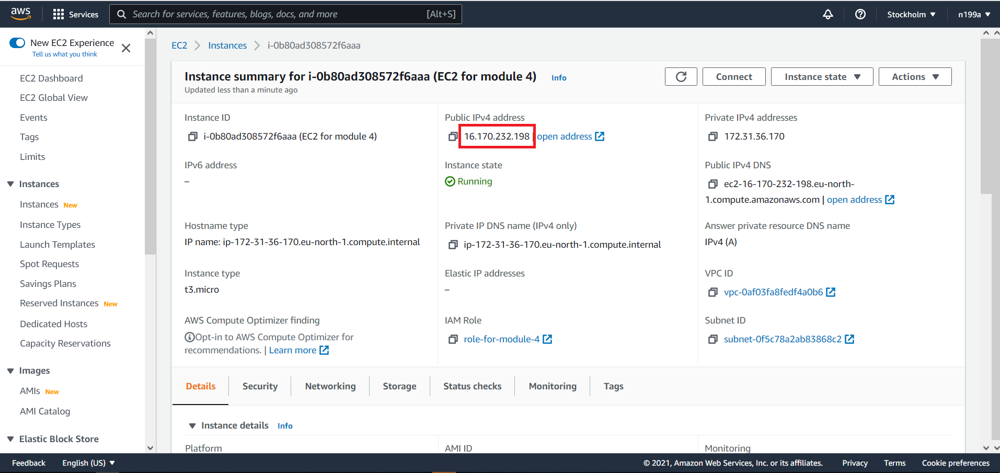
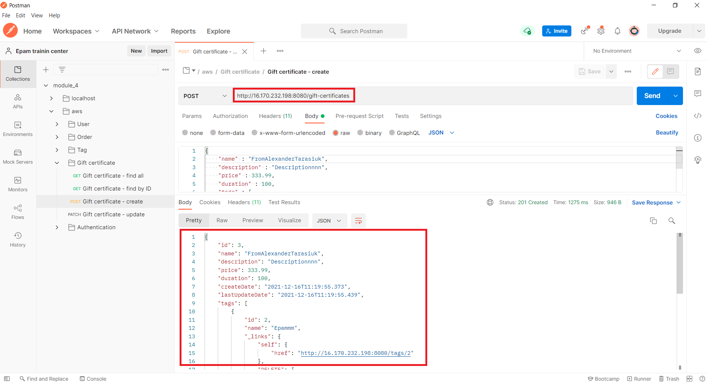

## Шаг 10 - Отправка запроса через Postman на `EC2` инстанс
Чтобы отправить HTTP запрос на сервер, необходимо знать его IP адрес. Для того, чтобы узнать IP адрес нашего созданного `EC2` инстанса, переходим:
1. Переходим по адресу `https://console.aws.amazon.com/ec2/`.
2. На панели навигации выберите `Instances`.
3. Выберите инстанс `EC2 for module 4`
4. Из секции `Public IPv4 address` Скопируйте IP

Отправляем запрос через порт `8080` (вы же помните, почему именно `8080`?):

Готово :)