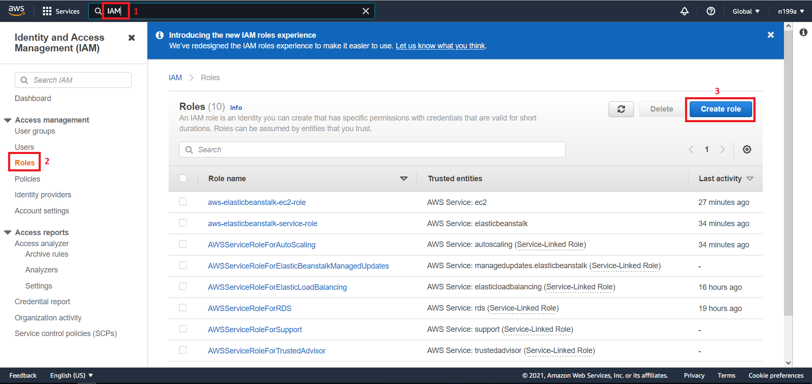
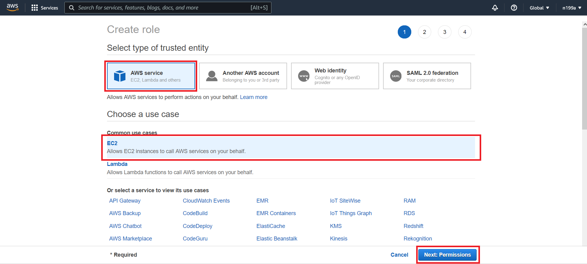
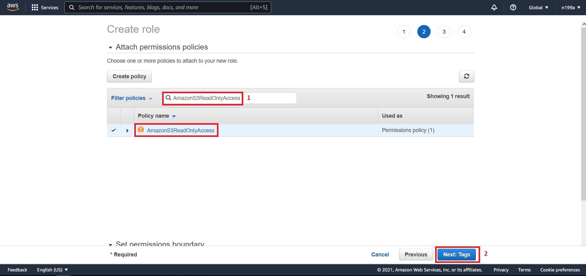
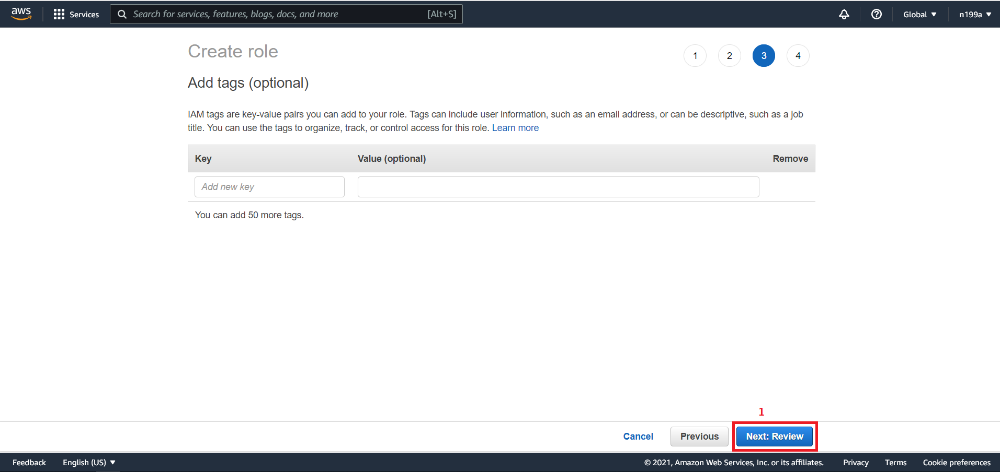
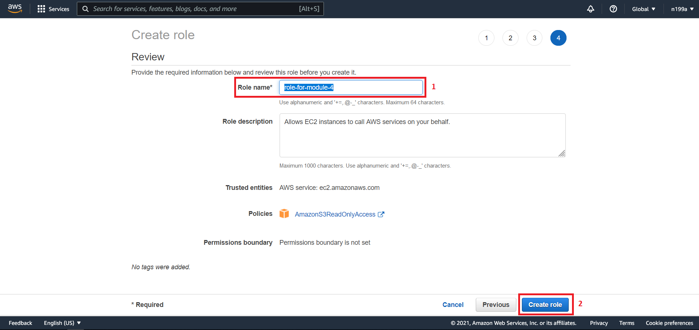
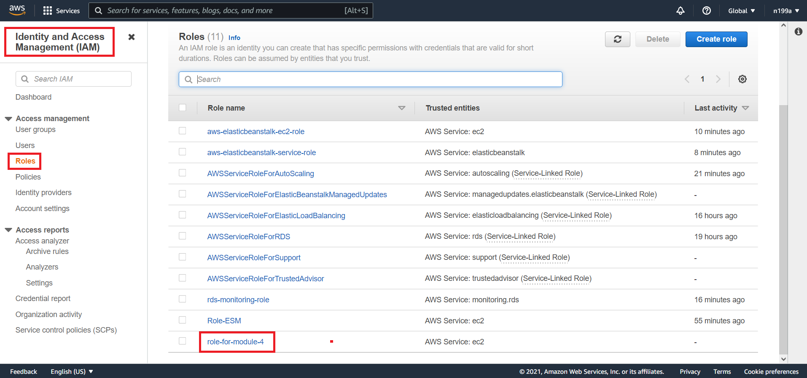

## Шаг 1 - Создание роли
### 1.1 Сервис `IAM`
На первом этапе мы будем создавать роль. Роль - это как права доступа на определенные действия.

Создаваемую нами роль мы будет применять в определенных моментах, требующих это.

За создание роли в `AWS` отвечает сервис под названием `IAM`, который расшифровывается как `Identity and Access Management`.

### 1.2 Создание роли с помощью `IAM`
Переходим в `IAM` - `Roles` - `Create role`:

Выбираем тип `AWS service`, а ниже выбираем `EC2`:

О том, почему мы выбрали `EC2` и что так такое `EC2`, вы узнаете на следующих этапах. 

Жмем кнопку `Next: Permissions` и попадаем на страницу выбора политики разрешений. В строку поиска вводим `AmazonS3ReadOnlyAccess`. Больше ничего не настраиваем на данной странице и жмем кнопку `Next: Tags`:

На странице тегов, в рамках данного задания, нам ничего настраивать не нужно, поэтому просто жмем кнопку `Next: Review`:

Попадаем на страницу `Review`, в которой задаем имя нашей будущей роли как `role-for-module-4` и жмем `Create role`:

Поздравляю вас, теперь в списке ролей вы можете увидеть созданную роль:

Следующий [шаг 2 - создание базы данных](step-2_creating-a-database-on-the-remote-server.md)