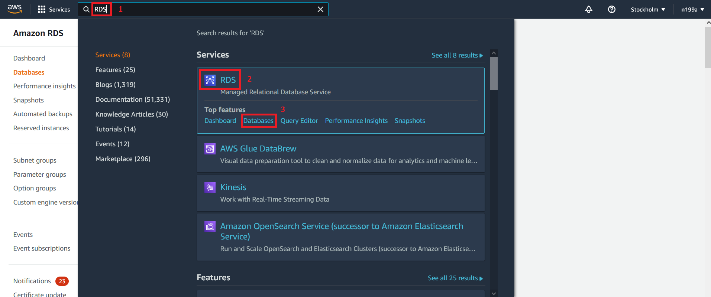

## Шаг 2 - Создание базы данных на удаленном сервере
Далее необходимо создать БД на `AWS`. Создание БД осуществляется с помощью Amazon сервиса `RDS`, который расшифровывается как `Relational Database Service`.

На самом деле `AWS` создас **кластер**, в котором и будет находиться ваша БД.

### 2.1 Переходим в сервис `RDS`
Чтобы попасть в раздел `RDS` необходимо в поле поиска ввести `RDS` и в разделе `RDS` выбрать подраздел `Databases`:



Перед вами откроется раздел `RDS`, где необходимо нажать кнопку `Create database`:


По состоянию на `14.12.2021` такой тип БД как `Amazon Aurora` является бесплатным, а `MySQL` и `PostgreSQL` являются платными, поэтому будем использовать `Amazon Aurora`.

У Вас может возникнуть вопрос, а как же использовать `MySQL` или `PostgreSQL`, ведь данные БД были использованы при написании проекта? А `Amazon Aurora` позволяет выбрать на следующем шаге версию БД `MySQL` или `PostgreSQL`:


Выбирайте необходимый тип БД (я использую `MySQL`) и идём дальше. Ниже можно выбрать версию `MySQL`, если необходимо. Я использовал ту версию, которая предлагается по умолчанию:


Далее следует раздел `Templates`. В нем я использовал шаблон `Production`, который предлагается по умолчанию:


Далее следует раздел `Settings`:


В данном разделе в секции `DB cluster identifier` задается имя кластера.

В секции `Credentials Settings` необходимо задать `Master username` и пароль для его, который необходимо прописать в вашем проекте. Эти данные используются для соединения с БД, которую мы сейчас создаем. У меня эти данные находятся в `application.properties` файле:
```properties
spring.datasource.username=admin
spring.datasource.password=admin12345admin
```

Далее следует раздел `DB instance class`, в котором оставляем настрокий по умолчанию:


Далее следует раздел `Availability & durability`, в котором я выбирал `Don't create an Aurora Replica`. О том, что это такое, можно прочитать в правой информационной колонке:


Далее следует раздел `Connectivity`. 

В разделе `Virtual private cloud (VPC)` - оставляем по умолчанию.

В разделе `Subnet group` - оставляем по умолчанию.

В разделе `Public access` я выбрал `YES`, чтобы была возможность подключиться и проверить соединение с БД (проверим ниже) с Вашего компьютера. Что означают опции `YES` и `NO` и так понятно расписаны.

В разеделе `VPC security group` выбираем существующую `Choose existing` и ниже в списке выбираем по имени (у меня это `launch-wizard-2`).

В разделе `Availability Zone` оставляем по умолчанию значение `No preference`, так как нам сейчас не важно, в какой зоне будет находиться наша БД.

В разделе `Additional configuration` оставляем порт по умолчанию `3306` для доступа к БД.


### 2.2 Устанавливаем соединения с БД
Чтобы проверить соединение с только что созданной БД необходимо узнать её хост.

#### Узнаем хост БД
Чтобы узнать `host` нашей БД переходим по пути: 

`RDS > Databases > YOUR_DATABASE_NAME > Connectivity & security > Endpoint & port` 

Тут нас интересует `Endpoint`, который и является `host`:


#### Создаем `Data Source`
Проверять подключение буду с помощью `Data Grip 2021.2`. 

В поле `Host` вводим значение из секции `Endpoint`, `Port = 3306`, `Authentication = USer & Password`, в поле `User = admin`, в поле `Password` вводим пароль.

#### Тестовое соединение с БД
При первом тестовом соединении я получил вот такую ошибку:


При нажатии на `Enable TLSv.1` автоматически добавились опции виртуальной машины:
```text
"-Djdk.tls.disabledAlgorithms=SSLv3, TLSv1, RC4, DES, MD5withRSA, DH keySize < 1024, EC keySize < 224, 3DES_EDE_CBC, anon, NULL, include jdk.disabled.namedCurves"
```

> TLS, как и его предшественник SSL, — криптографические протоколы, обеспечивающие защищённую передачу данных между узлами в сети Интернет.

После этого пробуем опять установить тестовое соединение:


И Intellij IDEA подсказывает нам о том, что лучше использовать драйвер `Amazon Aurora MySQL` для соединения с БД, а у меня был выставлен в Intellij IDEA при создании `Data Source` тип `MySQL` драйвера. Хорошо, меняем драйвер и качаем `Amazon Aurora MySQL`:


Теперь пробуем провести тестовое соединение с БД:


Следующий [шаг 3 - внесение изменений в код проекта](step-3_making-changes-to-the-project-code.md)
