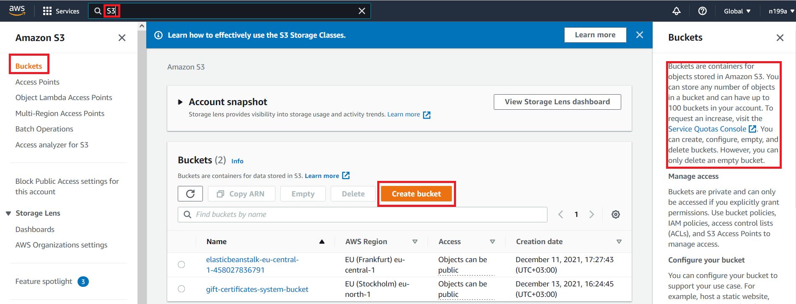
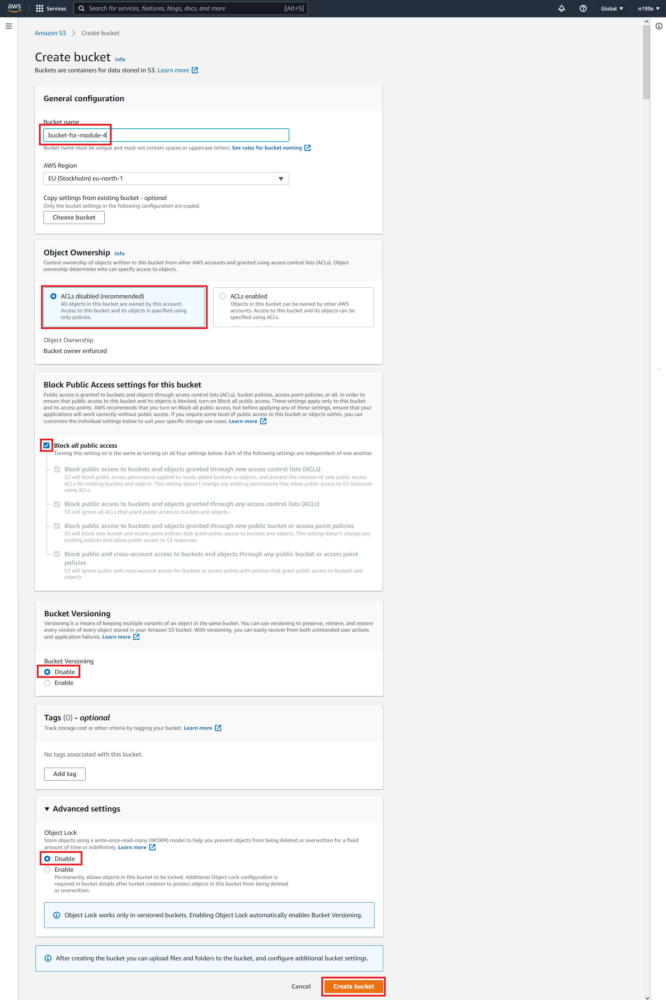
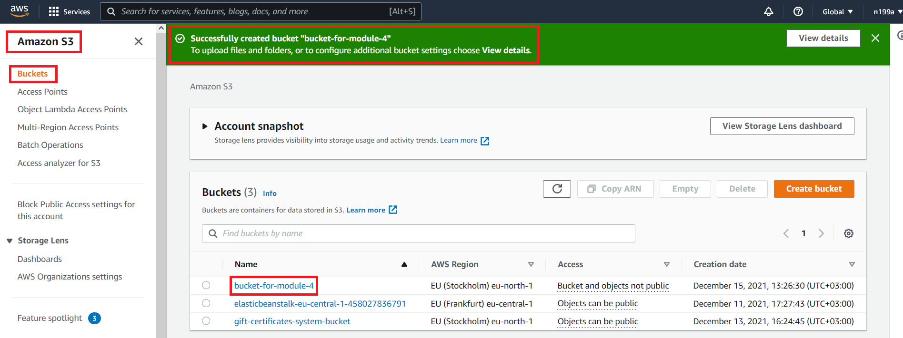
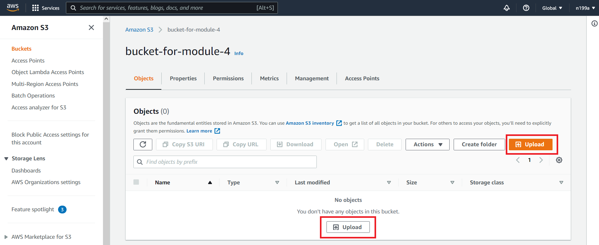
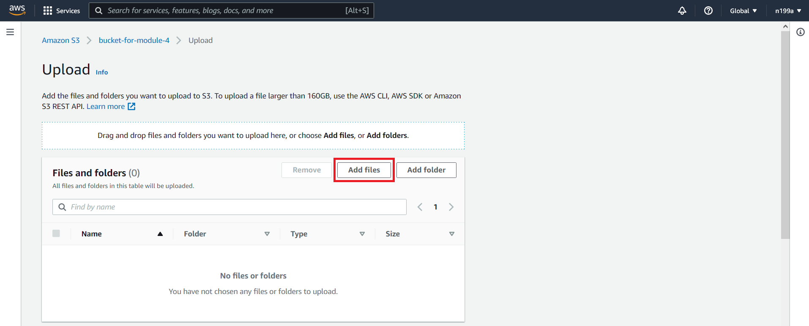
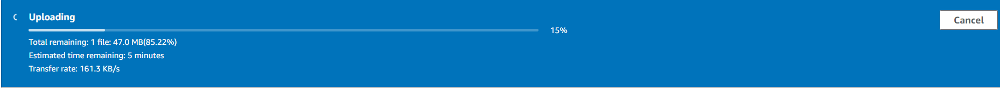
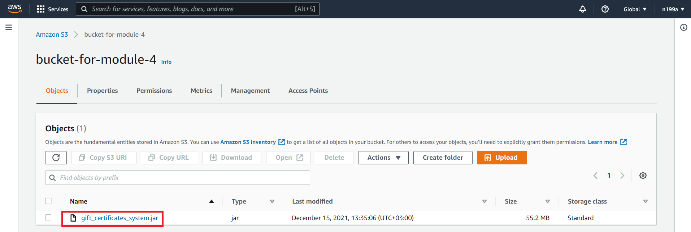
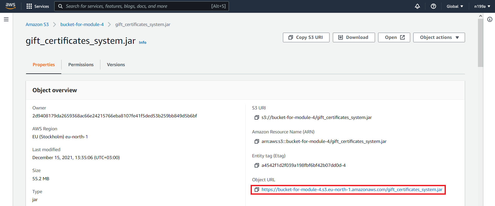

## Шаг 5 - Создание файлового хостинга внутри AWS
В качестве файлового хостинга внутри `AWS` отвечает служба под названием `S3`, что расшифровывается как `Amazon Simple Storage Service`. `S3` предоставляет возможность хранения и получения любого объёма данных в любое время из любой точки сети, так называемый файловый хостинг.

### 5.1 Создание `S3` бакета
Переходим в `S3 > Buckets` и нажимаем кнопку `Create bucket`:

Выставляем настройки как ниже и жмем опять `Create bucket`:

После создания `S3` бакета вы увидите его у себя в списке бакетов:

### 5.2 Загрузка проекта в `S3` бакет
Нажимаем на только что созданный бакет с именем `bucket-for-module-4`, а после жмем на любую кнопку `Upload`:

Далее нажимаем на кнопку `Add files` либо просто перетягиваем архив с проектом в открывшееся окно и жмем кнопку `Upload`:

После нажатия кнопки `Upload` пойдет загрузка проекта в наш бакет:

Когда архив загрузится, возвращайтесь к списку бакетов, заходите в `bucket-for-module-4` и выбирайте только что загруженный архив `gift_certificates_system.jar`:

Нам понадобится `Object URL`:

По данному `URL` находится только что загруженный архив с проектом. Скопируйте его себе, он нам понадобится далее. По данному `URL` можно будет скачать наш архив с проектом.

Следующий [шаг 5 - Создание виртуального сервера внутри AWS](step-6_creating-a-virtual-server-inside-AWS.md)