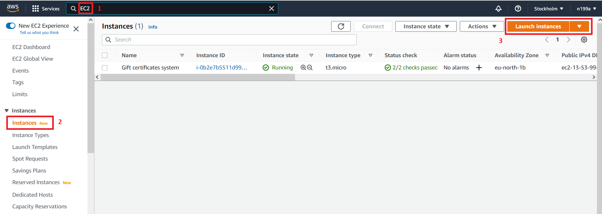

## Шаг 6 - Создание виртуального сервера внутри AWS
### 6.1 Определение `EC2`
В качестве виртульаного сервера будет выстапать сервис от Амазона под названием `EC2`.

`EC2` `Amazon Elastic Compute Cloud` — является одним из сервисов `Amazon Web Services`, позволяющий пользователю арендовать виртуальный сервер.

### 6.2 Создание `EC2`
Переходим в раздел `EC2` - `Instances`.

Попадаем в раздел `Instances`, где у меня уже есть один виртуальный сервер `EC2` с названием `Gift certificates system`. Для создания нового виртуального сервера (его ещё называют `инстанс`) жмем кнопку `Launch instances`:

#### Выбор `AMI`
В появившемся окне мы видим так называемые `AMI`:

`AMI` расшифровывается как `Amazon Machine Image` - это шаблон, который содержит конфигурацию программного обеспечения (операционную систему, сервер приложений и приложения), необходимую для запуска вашего экземпляра. 

Наверняка каждый из вас сталкивался с установкой операционной системы `Windows` на свой компьютер. Так вот, при создании выделенного сервера `EC2` автоматически установится та операционная система, которая находится в списке. Так как нам для выполнения данного модуля не важен тип операционной системы, то мы выбираем `Amazon Linux 2 AMI (HVM) - Kernel 5.10`.

Нажимаем кнопку `Select` и читаем дальше.

#### Выбор типа `AMI`
После нажатия кнопки `Select` мы попадаем в окно выбора типа виртуального сервера.

**Внимание!**
Необходимо выбрать именно `t3.micro`, так как данный тип является **бесплатным** для первых 12 месяцев пользования:

#### Настройка деталей
Попадаем на очередную страницу настроек.
Жмем кнопку `Next: Configure Instance Details` и попадаем на одну страницу настроек, где задаем роль для будущего выделенного сервера `EC2`:

Больше ничего на данной странице менять не нужно, жмем кнопку `Next: Add Storage`.

#### Настройка хранилища

На данной странице ничего не изменяем и жмем на кнопку `Next: Add Tags`

#### Настройка тегов

Попадаем на страницу настройки тегов. Настройка тегов не предусмотрена в задании, поэтому жмём кнопку `Next: Configure Security Group`.

#### Настройка Security Group
Сейчас мы находимся на странице группы безопасности, которая является брандмауэром, где можно задать определенные настройки доступа к нашему будущему выделенному серверу `EC2`.

Настройки для `SSH` оставляем, чтобы имелась возможность подключиться к нашему будущему выделенному серверу `EC2` через командную строку и установить `JDK` для возможности запуска нашего проекта.

На данной странице задаем имя группы безопасности как `security-group-for-module-4`, которая будет применена к выделенному серверу.

Далее нажимаем кнопку `Add Rule`, выбираем `Custom TCP Rule`, прописываем порт `8080`, а в `Source` выбираем `Anywere`.

Что мы этим сделала? Мы создали правило, согласно которому запрос из любого `IP` адреса по порту `8080` получил доступ к выделенному серверу.

Порт `8080` является портом по умолчанию для доступа к Tomcat.

Далее жмём кнопку `Review and Launch`:

#### Просмотр всех параметров
Далее попадаем на страницу просмотра всех параметров создаваемого выделенного сервера `EC2`, на которой просто жмем кнопку `Launch`:

#### Создание пары ключей
Теперь мы попали на страницу создания пары ключей. Пара ключей состоит из открытого ключа, который хранит AWS, и файла закрытого ключа, который вы храните. Вместе они позволяют вам безопасно подключаться к вашему выделенному серверу `EC2` через `SSH`. 

Для Windows AMI файл закрытого ключа требуется для получения пароля, используемого для входа в ваш экземпляр. 

Для Linux AMI файл закрытого ключа позволяет вам безопасно подключиться к вашему экземпляру по SSH. 

Amazon EC2 поддерживает типы пар ключей ED25519 и RSA. 

Вы выпадаем списке меняем `Choose an existing key pair` на `Create a new key pair`:

Далее задаем имя `key-for-module-4` для пары ключей. Это имя просто будет присвоено сгенерированному файлу с расширением `pem`. В итоге финальный файл, который мы сейчас скачаем, будет иметь вид: `key-for-module-4.pem`.

**Внимание!**  
Прежде чем продолжить, необходимо скачать файл закрытого ключа (файл * .pem). Храните его в надежном и доступном месте. **Вы не сможете повторно загрузить файл после его создания.** 

Нажимаем кнопку `Download Pair Key`, начинается скачивание ключа, а потом жмем кнопку `Launch Instances`:

Далее переходим к списку наших инстансов и ждем, пока он создадится и настроится. Данный инстанс назовём `EC2 for module 4`.

Когда всё будет готово, мы увидим в графе `Status check` значение `2/2 checks passed`:

И вот, спустя 1 минут наш `EC2 for module 4` инстанс готов к использованию. Самое время подключиться к нему.

Следующий [шаг 7 - Подключение к созданному `EC2` инстансу](step-7_connecting-to-the-created-EC2-instance.md)