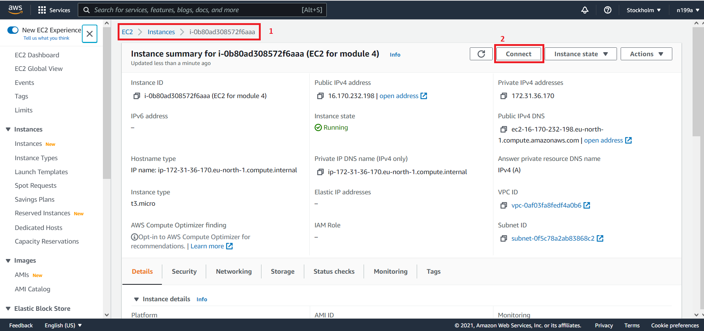
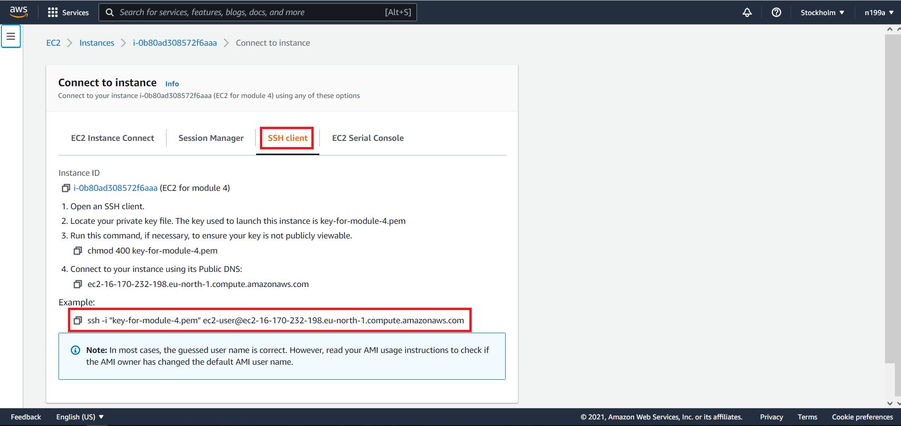
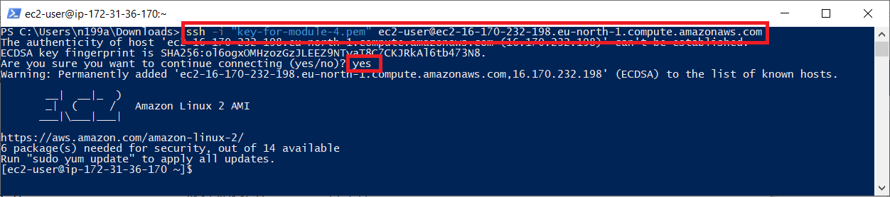

## Шаг 7 - Подключение к созданному `EC2` инстансу
Переходим в наш инстанс `EC2` - `Instances` - `EC2 for module 4` и жмем кнопку `Connect`:


На данной странице Amazone предоставляет данные, для доступа к нашему выделенному серверу по `SSH`.

Выбираем вкладку `SSH client` и копируем команду из секции `Example`:


Далее переходим в папку к скачанному на предыдущем шаге ключу `key-for-module-4.pem`, запускаем командную строку из данного каталога и вставляем команду:
```cmd
ssh -i "key-for-module-4.pem" ec2-user@ec2-16-170-232-198.eu-north-1.compute.amazonaws.com
```

На предложение `Are you sure you want to continue connecting (yes/no)?` отвечаем `yes`. И я вас поздравляю, мы успешно подключились к нашему созданному выделенному серверу:


Следующий [шаг 8 - Установка JDK на выделенный сервер](step-8_installing-the-JDK-on-a-dedicated-server.md)