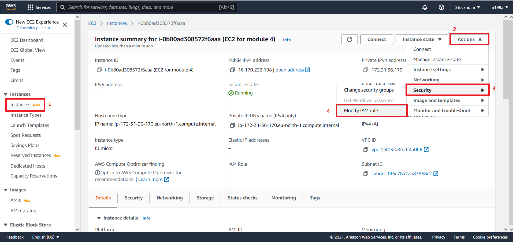
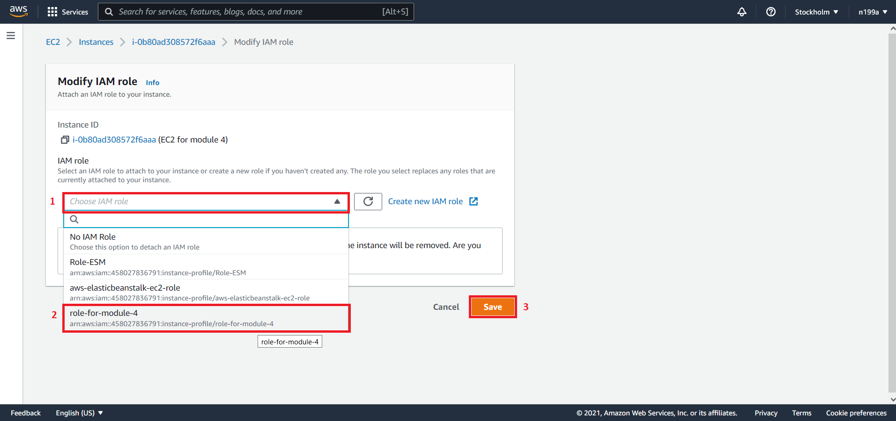
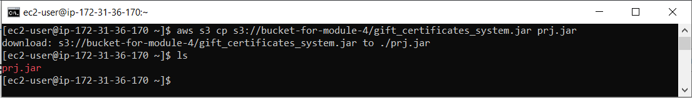
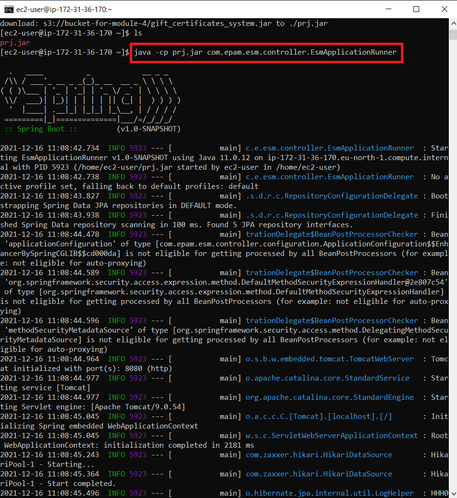

## Шаг 9 - Запуск приложения
Ранее мы не устанавливали созданную нами роль для `EC2` инстанса для того, чтобы наглядно увидеть, на что влияют роли и зачем они нужны.

Прежде чем запустить приложение, его необходимо скачать из нашего `S3` бакета к нам на выделенный сервер. Для этого пишем такую команду в командной строке:
```cmd
$ aws s3 cp s3://bucket-for-module-4/gift_certificates_system.jar prj.jar
```
где:
- `s3://bucket-for-module-4/gift_certificates_system.jar` - это `S3` URI
- `prj.jar` - это новое имя файла, под которым скопируется ваш проект из `S3` бакета.

Если во время выполнения данной команды вы получили ошибку:
```cmd
fatal error: Unable to locate credentials
```

Появление данной ошибки вызвано отсутствием роли. Чтобы получить доступ к бакету `S3` из `EC2`, необходимо назначить роль во время создания `EC2` (если этого не делали), и эта роль должна иметь права доступа к `S3`.

Для того, чтобы установить `IAM` роль к инстансу `EC2` выполните следующие шаги:
1. Переходим по адресу `https://console.aws.amazon.com/ec2/`.
2. На панели навигации выберите `Instances`.
3. Выберите экземпляр, выберите `Actions` - `Security` - `Modify IAM role`.
4. Выберите роль `IAM`, которую нужно присоединить к вашему экземпляру, и нажмите `Save`. 




Теперь давайте проверим, что файл `prj.jar` скопировался и существует уже на нашем `EC2` инстансе, для этого выполним команду:
`$ ls`

В результате увидим, что `prj.jar` существует:



Теперь запускаем наш проект командой:
```cmd
$ java -cp prj.jar com.epam.esm.controller.EsmApplicationRunner
```

Тут мы указываем путь до точки входа в приложение и название Java класса, которым у меня является `EsmApplicationRunner`.

В итоге увидим долгожданный запуск нашего приложения:



Следующий [шаг 10 - Отправка запроса через Postman на `EC2` инстанс](step-10_sending-a-request-via-postman-to-an-EC2-instance.md)