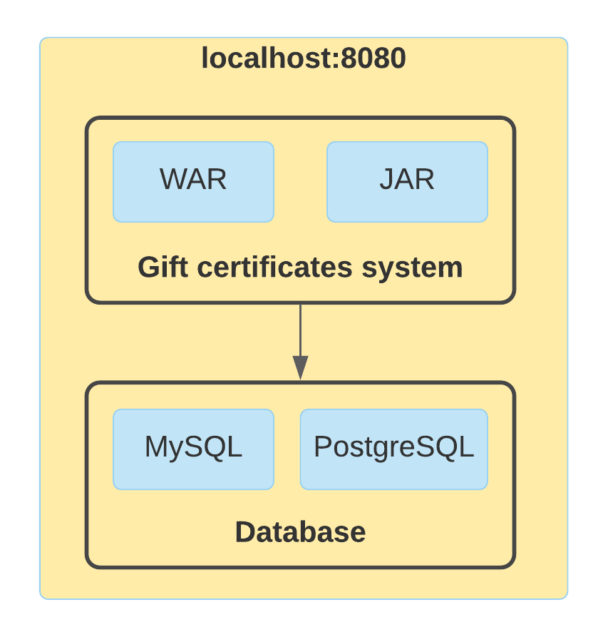
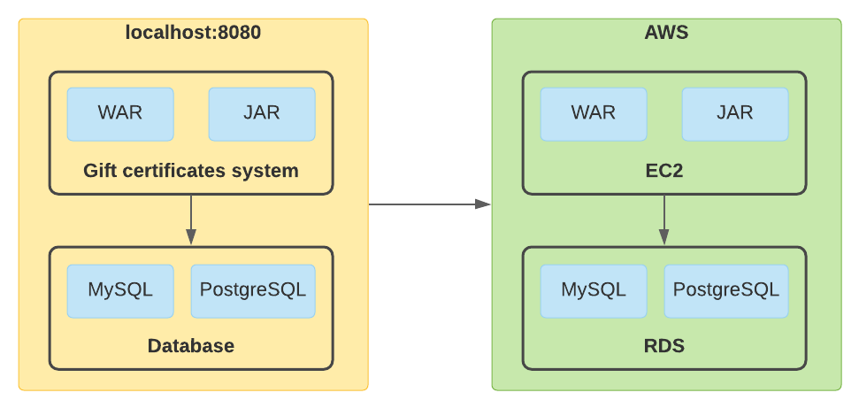
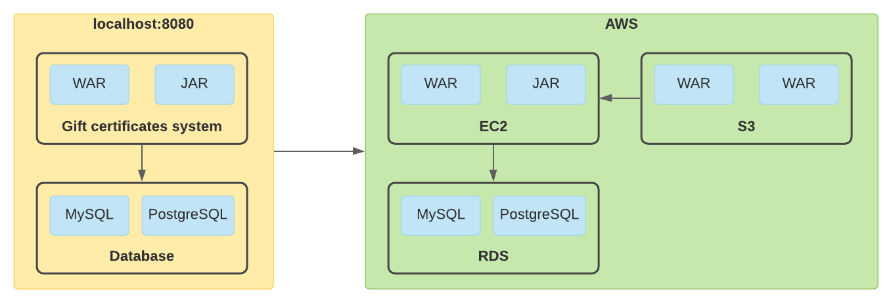

# AWS
`AWS` расшифровывается как `Amazon Web Services`.

## Условие
Оригинальные требования условия можно посмотреть [тут](aws_task.md), но выполнять данный модуль необходимо в другой последовательности.

Итак, для выполнения 5 модуля необхоидимо выполнить действия в следующей последовательности:
1. Создать роль
2. Создать БД
3. Создать файловый хостинг и загрузить туда наш проект
4. Создать виртуальный сервер, на котором запустим наш проект

## Общее представление
Да данный момент запуск приложения и обращение приложения к БД осуществляется локально и схематически выглядит так:

Задача данного модуля - перенести приложение на удаленный сервер и использовать БД, находящуюся тоже на удаленном сервере:

А сам проект сначала загрузим в `S3`, а оттуда скопируем его в `EC2`:

Что обзначают аббревиатуры `EC2`, `S3` и `RDS` вы узнаете далее, всё по порядку.

## Предисловие
Так как UI в `AWS` меняется с течением времени, возможно при выполнении данного задания некоторые элементы могуть быть видоизменены и находиться в другом месте.

Некоторые элементы в сервисах являются **платными**, мы же будем использовать **бесплатные** настройки.

Ну что, приступим!

[Шаг 1 - Создание роли](instruction/step-1_role-creation.md)
