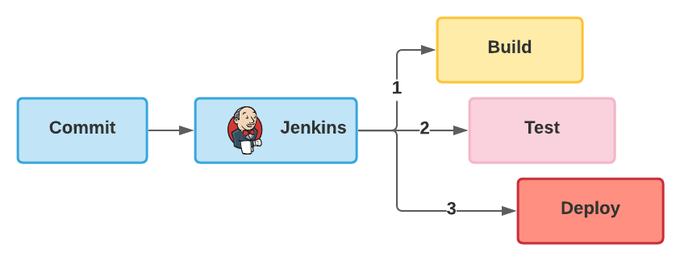

# CI-CD
## Условие модуля
С задачами, выполнение которых требует модуль, можно ознакомиться по [ссылке](task/module_6_task.md).

## Краткая теория
`CI` расшифровывается как `Continuous Integration`.

`CD` расшифровывается как `Continuous Delivery`.

Последовательность определенных шагов (действий) назвали как `CI` и `CD`, а каких действий? Смотрим ниже и всё становится понятно:

Компилировать проект - `Build`, запускать тесты - `Test` и выполнять деплой проекта - `Deploy` будет `Jenkins`:

## Задание
1. Configure Jenkins security (install Role strategy plugin). Remove anonymous access. Create administrator user (all permissions) and developer user (build job, cancel builds). Add Jenkins credentials to Readme file in your git repository. 
2. Configure Jenkins build job (pool, run test, build) to checkout your repository, use pooling interval.
3. Install SonarQube. Configure Jenkins to use local SonarQube installation. Analyze your source code with SonarQube after Maven builds your project. Use JaCoCo for code coverage. 
4. Jenkins should deploy your application (after passing SonarQube quality gate) under your local tomcat server. Please use Jenkins Tomcat Deploy plugin.

С полным текстом задания можно ознакомиться по [ссылке](task/module_6_task.md).

## Оглавление
Выполнение задания будем рассматривать пошагово:
1. [Step 1 - Configure Jenkins security (install Role strategy plugin). Remove anonymous access. Create administrator user (all permissions) and developer user (build job, cancel builds). Add Jenkins credentials to Readme file in your git repository.](solution/step_1.md)
2. [Step 2 - Configure Jenkins build job (pool, run test, build) to checkout your repository, use pooling interval.](solution/step_2.md)
3. [Step 3 - Install SonarQube. Configure Jenkins to use local SonarQube installation. Analyze your source code with SonarQube after Maven builds your project. Use JaCoCo for code coverage.](solution/step_3.md)
4. [Step 4 - Jenkins should deploy your application (after passing SonarQube quality gate) under your local tomcat server. Please use Jenkins Tomcat Deploy plugin.](solution/step_4.md)

## Данные
`SonarQube` token for Jenkins - `72804f99e459e6e601c7bd296e20b96d70b20740`