## Step 1
Текущее условие разделим на более мелкие задачи:
1. Configure Jenkins security (install Role strategy plugin). 
2. Remove anonymous access. 
3. Create administrator user (all permissions) and developer user (build job, cancel builds). 
4. Add Jenkins credentials to Readme file in your git repository.

## 1.1 Configure Jenkins security (install Role strategy plugin)
В инструкции написано установить плагин `Role strategy`, но плагин имеет другое имя - `Role-based Authorization Strategy`.

### Описание плагина `Role-based Authorization Strategy`
Плагин `Role-based Authorization Strategy` включает авторизацию пользователя с использованием ролевой стратегии. Роли могут быть определены глобально или для конкретных jobs или nodes, выбранных с помощью регулярных выражений. 

### Установка плагина
Для установки плагина переходим `Dashboard` → `Mange Jenkins` → `System Configuration` → `Manage Plugins` → `Available` и ищем плагин с названием `Role-based Authorization Strategy`:

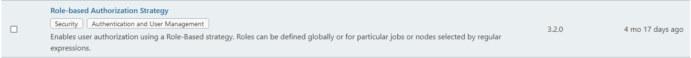

Ставим галочку напротив данного плагина и выбираем один тип установки:

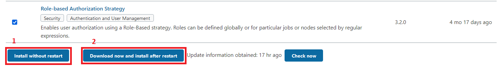

На открывшейся странице листаем в самый низ и ставим галочку напротив пункта `Restart Jenkins when installation is complete and no jobs are running`:

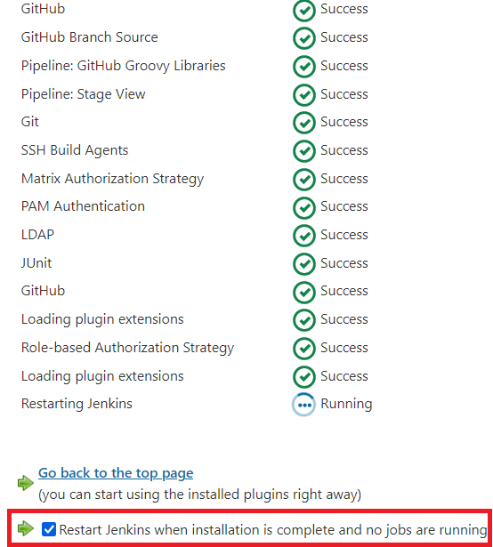

Смысла ждать, пока напротив процесса `Restarting Jenkins` появится зеленая иконка с надписью `Seccuess`, нет (этого, вроде как, вообще не произойдет, т.к. при перезапуске процесса произодет выход из сессии). Просто обновите страницу и заново авторизовывайтесь.

## 1.2. Remove anonymous access
### Немного теории
Анонимный доступ позволяет пользователям получать доступ к Jenkins в режиме `только для чтения` без аутентификации.

### Отключение анонимного доступа
Переходим `Manage Jenkins` → раздел `Security` → `Configure global security` и снимаем галочку напротив пункта `Allow anonymous read access`. У меня по умолчанию галочки там не стояло.

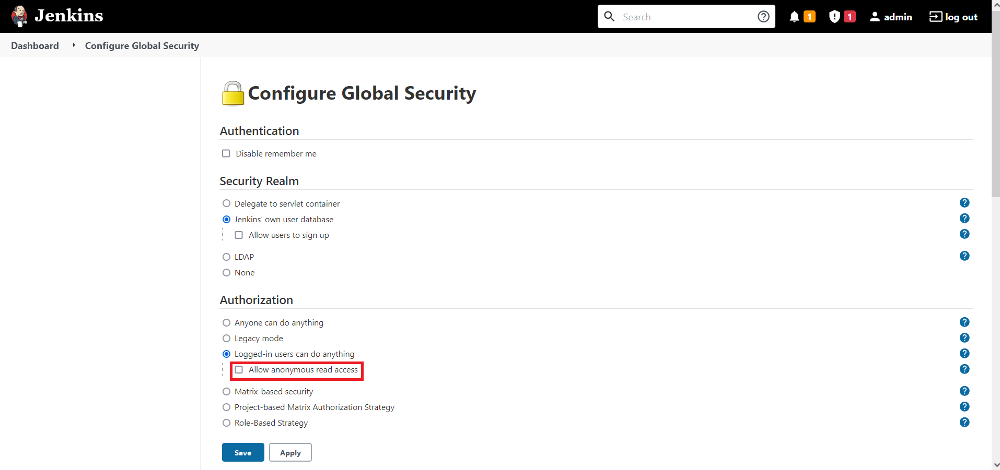

## 1.3. Create administrator user (all permissions) and developer user (build job, cancel builds)
Переходим `Manage Jenkins` → раздел `Security` → `Configure global security` и в секции `Authorization` выбираем `Role-Based Strategy`:

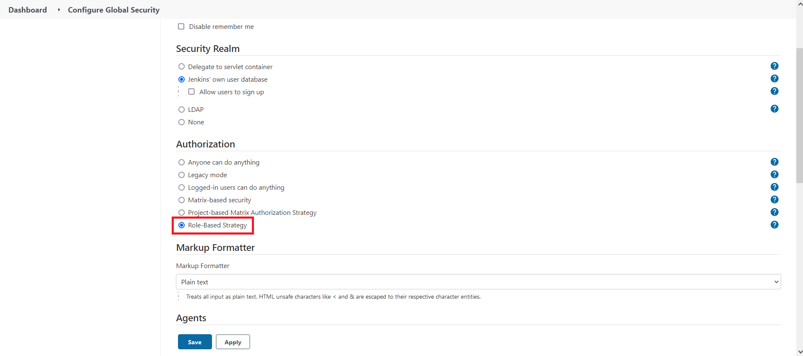

### Создание ролей
Первым делом займемся созданием ролей для будущих пользователей.

Переходим  `Manage Jenkins` → раздел `Security` → `Manage and Assign Roles` → `Manage Roles`. 

В разделе `Global roles` в секции `Role to add` вписываем название ролей `administrator` и `developer` и жмем ниже кнопку `Add`. 

Теперь будем выставлять полномочия. Для пользователя `administrator` выставляем все галочки. Для пользователя `developer` в секции `Job` ставим галочки для `Build`	и `Cancel` (находятся рядом):

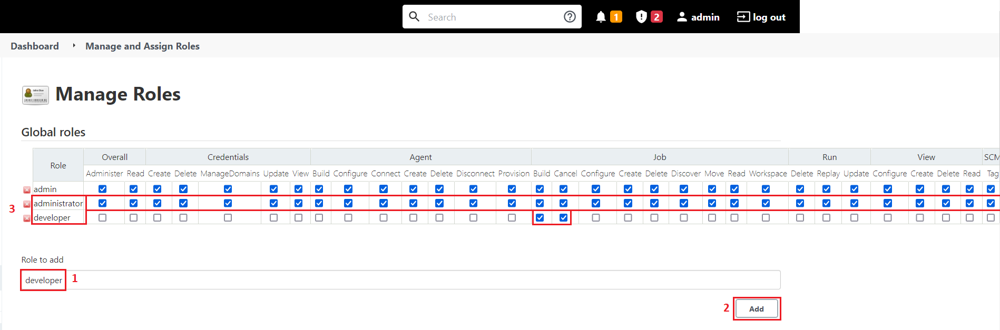

Далее переходим `Manage Jenkins` → раздел `Security` → `Manage and Assign Roles` → `Assign Roles`.

### Создание пользователей
Теперь будем создавать пользователей, которым и присвоим роли `administrator` и `developer`, созданные на предыдущем шаге.

Переходим `Manage Jenkins` → раздел `Security` → `Manage Users` → слева в меню `Create User` и создаем пользователя с именем `Administrator`, которому назначим роль администратора, и пользователя с именем `Developer`, которому назначим роль разработчика.

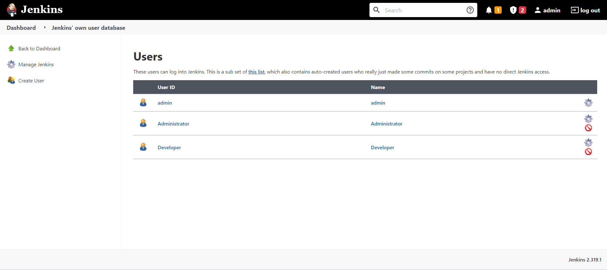

Если мы попробуем зайти под только что созданным пользователем `Administrator` либо `Developer`, то увидим предупреждение:
```cmd
Access Denied
Administrator is missing the Overall/Read permission
```

Это происходит по причине того, что роль ещё не назначена.

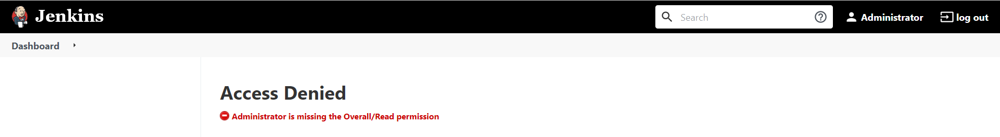

### Присвоение ролей пользователям
Переходим  `Manage Jenkins` → раздел `Security` → `Manage and Assign Roles` → `Assign Roles`. На моё удивление я не видел в списке пользователей созданных пользователей:

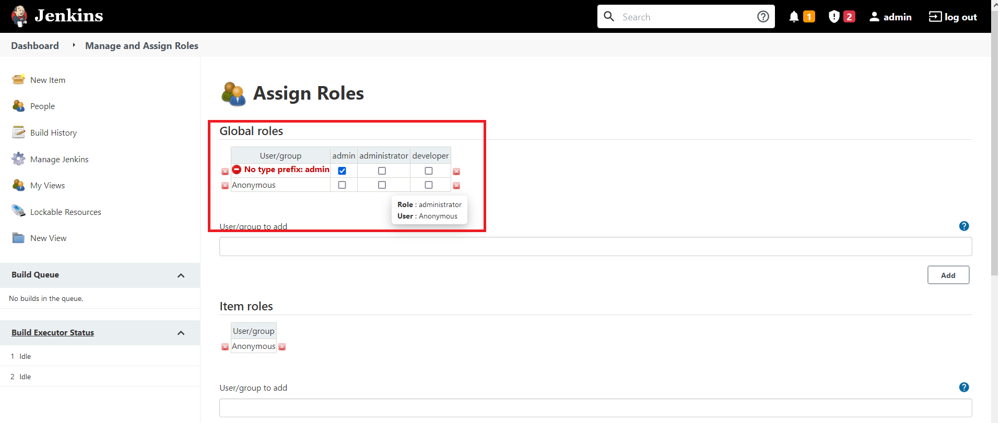

Указав в секции `User/group to add` логины пользователей, я увидел их в списке и назначил соответствующие роли. Странное поведение у Jenkins'a:

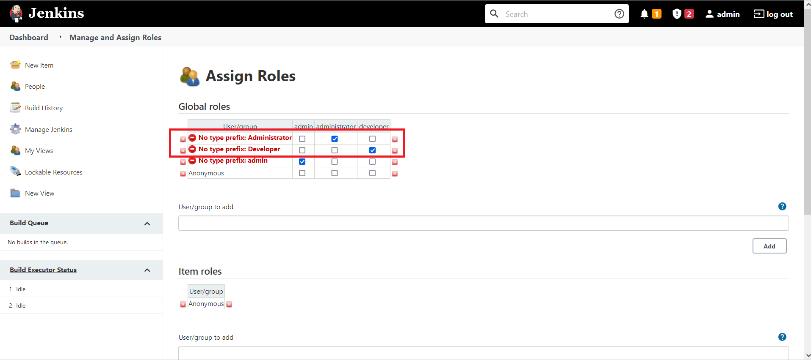

Теперь, когда роли назначены, пробуем авторизоваться под `Administrator`:

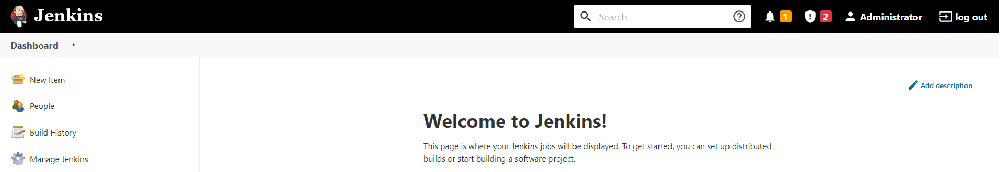

Успешно.

В условии не указано, создавать `Job` необходимо от пользователя `Administrator` или `Developer`, поэтому будем выполнять под `Administrator`.

## 1.4 Add Jenkins credentials to Readme file in your git repository.
Тут всё просто, открываем файл `README.md` в нашем репозитории и вносим туда данные пользователей:
```md
Jenkins credentials (username:password):
1. Administrator:Administrator
2. Developer:Developer
```

Переходим к [шагу 2 - Configure Jenkins build job (pool, run test, build) to checkout your repository, use pooling interval.](step_2.md)