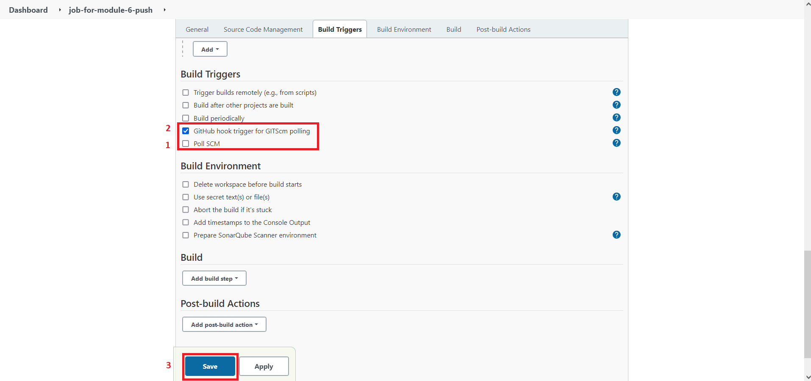

## Step 2
Текущее условие звучит как `Configure Jenkins build job (pool, run test, build) to checkout your repository, use pooling interval.`.

### Подготовка
Для выполнения данного шага необходимо наличие плагина [GitHub plugin](https://plugins.jenkins.io/github/).

### Генерация SSH ключа
Сначала необходимо сгенерировать SSH ключ можно для Windows и Linux одной командой из командной строки или терминала:
```cmd
ssh-keygen
```

В итоге будет создано два файла с заданным именем там, откуда был запущен терминал либо командная строка:
```text
ssh-for-jenkins
ssh-for-jenkins.pub
```

`ssh-for-jenkins` - приватный.

`ssh-for-jenkins.pub` - публичный.

Данный SSH ключ будет использоваться далее при создании `Job`.

### Добавление SSH ключа в GitHub
Теперь необходимо в своём аккаунте на `GitHub` добавить ранее сгенерированный **публичный** SSH ключ, для чего переходим на сайт `GitHub` → `Settings` → `SSH and GPG keys` → кнопка `New SSH key`:
1. В `Title` вводим `Jenkins` (можно любое)
2. В `Key` вставляем содержимое `SSH` ключа с именем `ssh-for-jenkins.pub`
3. Жмем кнопку `Add SSH key`


После этого вы увидите созданный SSH ключ для Jenkins'a:


### Создание Job и добавление SSH ключа
Для создания `Job` необходимо перейти в пункт меню `New Item`, задать имя `job-for-module-6`, выбрать `Freestyle project` и нажать `OK`:


Далее ставим галочку напротив `Discard old builds` и в поле `Max # of builds to keep` прописываем значение `2`. На каждый запуск `Job` в директории дженкинса `C:\ProgramData\Jenkins\.jenkins\jobs\job-for-module-6\builds\` создается каталог с необходимой для Jenkins информацией и для того, чтобы не захламлять свободное пространство, мы устанавливаем максимальное количество существующих каталогов для последних запусков равное двум:


В секции `Source Code Management`:
1. Выбираем `Git`
2. В `Repository URL` вводим путь до вашего репозитория без учета `branch`
3. В `Credentials` выбираем `Add` → `Jenkins`
4. В появившемся окне с именем `Jenkins Credentials Provider: Jenkins` в графе `Kind` выбираем `SSH Username with private key`
5. В графе `ID` вводим `github-ssh-private-key` (можно любое)
6. В графе `Username` вводим логин от вашего `GitHub` аккаунта
7. В графе `Private Key` выбираем `Enter directly` → `Add` и вставляем содержимое SSH **приватного** ключа `ssh-for-jenkins`
8. В завершение жмем кнопку `Add` в самом низу для создания


Теперь в графе `Branch Specifier (blank for 'any')` вводим имя нужной ветки, у меня ветка называется `module_6`, но записывать необходимо `*/module_6`:


Когда при создании `Job` мы в `Source Code Management` указываем `Git` и задаем `Credentials`, то Jenkins, при выполнении данной задачи, выполнит:
```cmd
git clone https://github.com/n199a/epam_training_center/tree/module_6
```

Теперь давайте проверим созданную `Job`. После успешного выполнения вы увидите вот такое:


Хорошо, часть `Job` выполнена и она отрабатывает успешно, идём далее.

### Build Triggers
По умолчанию Jenkins предлагаем нам 4 вида `Build Triggers`:
1. `Trigger builds remotely (e.g., from scripts)` - Jenkins сгенерирует нам `URL` и при переходе по данному `URL` запустится `Job`.
2. `Build after other projects are built` - текущий `Job` автоматически запустится после того, как предыдущий `Job` закончит своё выполнение.
3. `Build periodically` - выполнение `Job` по расписанию (через определенное количество минут, часов, в какой день и т.п.)
4. `Poll SCM` = `Build periodically` + Jenkins проверит, есть ли изменения в `GitHub` репозитории (проверит, есть ли новый `commit`, если да - запустит `Job`).
5. `GitHub hook trigger for GITScm polling` (появляется после установки плагина `GitHub plugin`)

Для выполнения нашего задания подойдет `Build periodically` или `Poll SCM`. Я буду использовать `Poll SCM`, что расшифровывается как `Source Control Management`. 

#### Важно!
Чтобы использовать `Pool SCM`, необходимо заполнить секцию `Source Control Management` выше.

Мы рассмотрим два варианта выполнения задачи:
1. Использование `Poll SCM`
2. Использование `GitHub hook trigger for GITScm polling`

Отличие `GitHub hook trigger for GITScm polling` от `Poll SCM` заключается в том, что при использовании `GitHub hook trigger for GITScm polling` нашу `Job` от Jenkins будет запускать сам `GitHub` сразу после того, когда в нашем репозитории на `GitHub` будет выполнена команда `push` (опционально).

### Вариант 1 - Использование `Poll SCM`
При выборе галочкой пункта `Pool SCM` появится поле ввода с названием `Schedule`. 

> Чтобы узнать, что вводить в поле `Schedule`, можно нажать на синюю иконку со знаком вопроса.

Если мы введем `* * * * *`, то данная `Job` будет запускаться **каждую минуту** (очень удобно во время демонстрации выполненного задания по причине того, что не нужно будет ждать кучу времени). Так и сделаем:


#### Как работает `Poll SCM`
После создания данной `Job`, Jenkins запустит эту `Job` через минуту. Далее `Job` запустится сразу. Через минут Jenkins опять запустит `Job`, которая проверяет наличие нового `commit` по сравнению с предыдущим запуском. Если есть новый `commit` - сделать `git clone`, если нет нового `commit` - завершить выполнение `Job`.

#### Проверка выполнения `Job` + `Git` + `Poll SCM`
Делаем новый `commit` + `push` в `GitHub` и через минуту видим, что `Job` выполнилась успешно:


В `Console Output` мы даже можем видеть сообщение последнего `commit`:

```text
Commit message: "Modify REAMDE.md and chanche folders structure"
```

### GitHub - Your SSH private key has been revoked
Интересно то, что после выполнения данной `Job` мне на почту пришло письмо от `GitHub`, в котором говорится, что мой приватный SSH ключ был отозван с целью защиты данных от несанкционированного доступа:


Заходим в раздел с SSH ключами на GitHub  и видим:


Жмем кнопку `Approve` и теперь `Job` может дальше выполняться :)

### Вариант 2 - Использование `GitHub hook trigger for GITScm polling`
Создадим новую `Job` на основе `Job` с именем `job-for-module-6` и назовем её `job-for-module-6-push`:


Первым делом необходимо отметить чекбокс `GitHub project` и в `Project url` вставить URL репозитория на GitHub, получится уже в двух местах указание одного и того же `URL`:


Можно использовать данные из `HTTPS` либо `SSH`, будет работать и так и так:


Теперь в Jenkins опускаемся немного ниже и:
1. Убираем галочку из `Poll SCM`
2. Ставим галочку на `GitHub hook trigger for GITScm polling`
3. Жмем в самом низу кнопку `Save`



Теперь необходимо добавить `hook` на `GitHub`. Для этого:
1. Переходим на страницу GitHub репозитория
2. `Settings` → `Webhooks` → `Add webhook`
3. В `Payload URL` вводим URL в формате:
   ```
   http://<ip-to-jenkins>:8080/github-webhook/
   ```
4. `Content type` выставляем в `application/json`
5. Жмем кнопку `Add webhook`


> localhost использовать нельзя :)

В секции `Which events would you like to trigger this webhook?` можно выбрать `Let me select individual events.` и отметить те события, на которые должен будет реагировать `GitHub` в рамках текущего репозитория.

Если коротко, то смысл `Webhooks` заключается в том, чтобы `GitHub` отправил POST запрос с JSON форматом на заданный вами URL после выполнения `push` команды. Далее, Jenkins извлечет данные из JSON и получит строку, в которой будет URL к нашему репозиторию и запустит соответствующую `Job` (которую мы выше создали).

Переходим к [шагу 3 - Install SonarQube. Configure Jenkins to use local SonarQube installation. Analyze your source code with SonarQube after Maven builds your project. Use JaCoCo for code coverage](step_3.md)