## Step 3
Текущее условие звучит как `Install SonarQube. Configure Jenkins to use local SonarQube installation. Analyze your source code with SonarQube after Maven builds your project. Use JaCoCo for code coverage.`

Текущее условие разделим на более мелкие задачи:
1. Install SonarQube. 
2. Configure Jenkins to use local SonarQube installation. 
3. Maven builds your project.
4. Analyze your source code with SonarQube.
5. Use JaCoCo for code coverage.

## Подготовка
Перед выполнением следующих шагов установите два плагина:
1. [JaCoCo](https://plugins.jenkins.io/jacoco/)
2. [SonarQube Scanner for Jenkins](https://plugins.jenkins.io/sonar/)

### 1. Install SonarQube
Установка `SonarQube` делится на 2 шага:
1. Установка приложения `SonarQube` с [официального сайта](https://www.sonarqube.org/downloads/)
2. Установка плагина `SonarQube Scanner for Jenkins` внутри `Jenkins`

Я устанавливал `SonarQube CommunityEdition`, так как данная версия является бесплатной и может выполнять всё, что требуется в рамках заданий модуля № 6.

После установки `SonarQube` с официального сайта нам необходимо сгенерировать `SonarQube authentication token`, который дальше нам понадобится. Переходим по адресу `http://localhost:9000`, в шапке выбираем пункт меню `Administration` → `Security` → `Users`. Далее, у пользователя `Administrator admin` в столбце `Tokens` выбираем пункт `Update Tokens`:

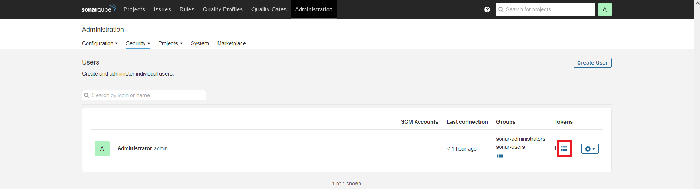

Во всплывающем окне вводим любое имя токену и жмем кнопку `Generate`:

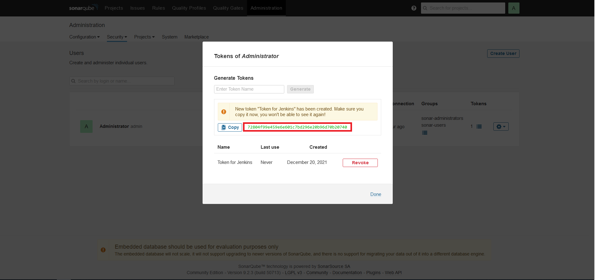

Сгенерированный токен копируйте и сохраните, так как повторно увидеть токен не получится.

### 2. Configure Jenkins to use local SonarQube installation
`Manage Jenkins` → `Configure system` → секция `SonarQube servers`:
1. Ставим галочку `Environment variables Enable injection of SonarQube server configuration as build environment variables`
2. Жмем кнопку `Add SonarQube`
3. В графе `Name` пишем имя `SonarQube for module 6`
4. В графе `Server URL` ничего не пишем, так как по умолчанию адресом является `http://localhost:9000`
5. В графе `Server authentication token` жмем кнопку `Add` → `Jenkins`

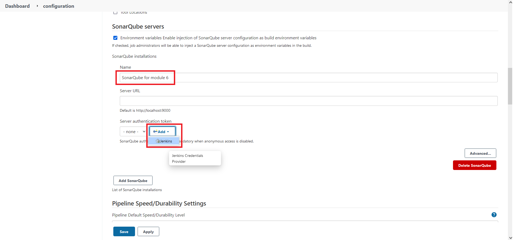

В появившемся окне выставляем следующее:
1. `Kind` = `Secret text`
2. В поле `Secret` вставляем сгенерированный токен
3. В поле `ID` пишем `SonarQube-Token` (пробельные символы запрещены)
4. В конце жмем кнопку `Add`

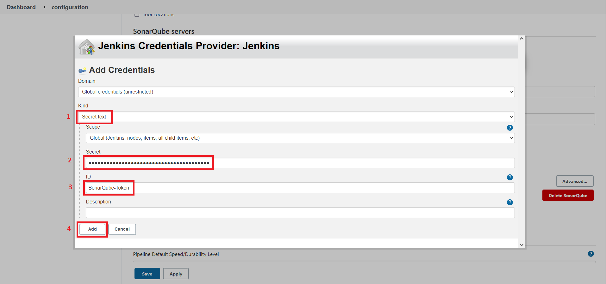

После нажатия кнопки `Add` окно `Jenkins Credentials Provider: Jenkins` закроется и в графе `Server authentication token` выбираем только что созданную запись с именем `SonarQube-Token` и жмем `Save`:

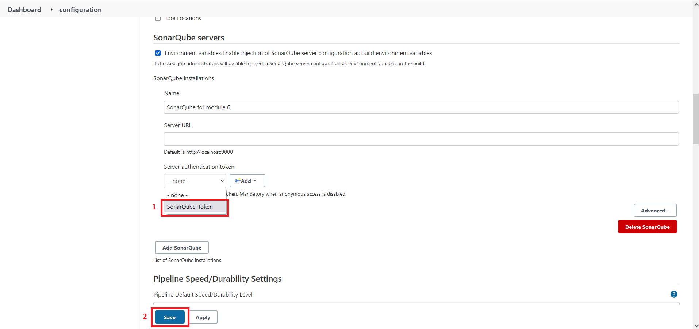

Теперь переходим в `Manage Jenkins` → `Global Tool Configuration` → `SonarQube Scanner` → `Add SonarScanner for MSBuild` и ф графе `Name` пишем любое имя и сохраняем:

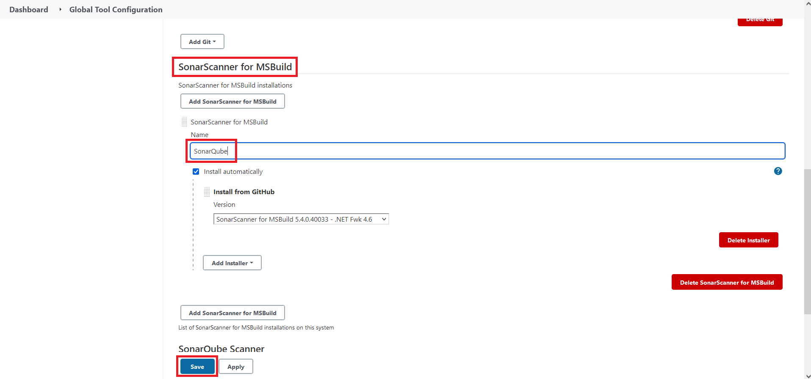

### 3. Maven builds your project
Для того, что Maven мог выполнить `build` скачанного из репозитория проекта, необходимо установить плагин для Jenkins под названием [Maven Integration](https://plugins.jenkins.io/maven-plugin/).

Сейчас необходимо настроить Jenkins для того, чтобы он использовал Maven. Для этого переходим `Manage Jenkins` → `Global Tool Configuration` → `Add Maven`:
1. В секции `Name` пишем любое имя
2. Ставим галочку `Install automatically`
3. Выбираем нужную версию `Maven`
4. Сохраняем

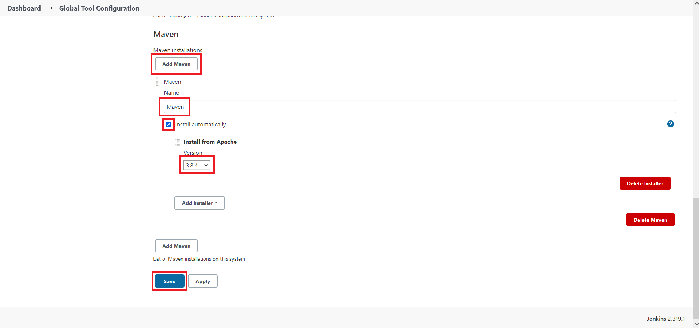

Теперь в Jenkins создаём новую `Job` с именем `job-for-module-6-maven` типа `Maven project` и настраиваем его так, как настроен `job-for-module-6`. 

В разделе `Root POM` необходимо указать путь до корневого `pom.xml` вашего проекта и, если у вас в репозитории имеются дополнительные пакеты (как у меня), то чтобы узнать путь до `pom.xml` переходим в каталог, куда Jenkins склонирует ветку вашего проекта, а в Windows это:

```text
C:\ProgramData\Jenkins\.jenkins\workspace\job-for-module-6-maven
```

Находим корневой `pom.xml` и записываем путь (у меня это `module_4/gift_certificates_system/pom.xml`):

В разделе `Build` в секции `Goals and options` вписываем опции Maven `clean package -DskipTests` (без выполнения).

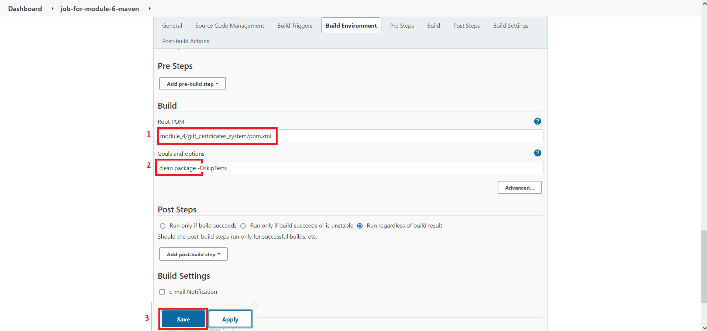

Сохраняем, через минуту запустится `Job`, ждем пока наш проект со всеми зависимостями скачается и проверяем успешность выполнения:

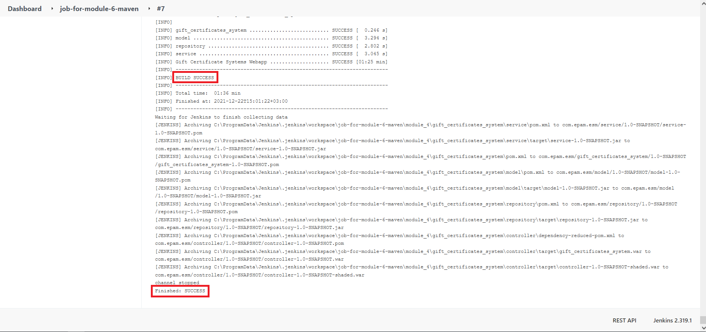

Теперь давайте проверить, появился ли у нас `*.war` файл. Переходим по пути:

```text
C:\ProgramData\Jenkins\.jenkins\workspace\job-for-module-6-maven\module_4\gift_certificates_system\controller\target
```

и видим, что появился файл `gift_certificates_system.war`, а это значит, что наш проект сбилдился.

Хорошо, идём далее.

### 4. Analyze your source code with SonarQube.
Сейчас будем вносить дополнения в нашу `Job` для того, чтобы выполнялся анализ кода с помощью `SonarQube`. Открываем нашу `Job` с именем `job-for-module-6-maven`, опускаемся к секции `Post Steps`:
1. Пункт `Run regardless of build result` (Запускать независимо от результата сборки) меняем на пункт `Run only if build succeeds` (Запускать, только если сборка прошла успешно).
2. Жмем `Add post-build step` → `Execute SonarQube Scanner`
3. В секцию `Analysis properties` вписываем:
   ```text
    sonar.projectKey=my:project
    sonar.language=java
    sonar.java.binaries=.
   ```

Если не указать `sonar.projectKey`, то при выполнении `Job` получим ошибку:
```text
ERROR: Error during SonarScanner execution
ERROR: You must define the following mandatory properties for 'Unknown': sonar.projectKey
```

Если не указать `sonar.java.binaries`, то при выполнении `Job` получим ошибку:
```text
org.sonar.java.AnalysisException: Your project contains .java files, please provide compiled classes with sonar.java.binaries property, or exclude them from the analysis with sonar.exclusions property.
```

Теперь давайте укажем нашей `Job` выполнить проверку тестов нашего проекта и предоставить отчет, для этого опускаемся ниже к разделу `Post-build Actions` → `Add post-build actions` → `Record JaCoCo coverage report`:

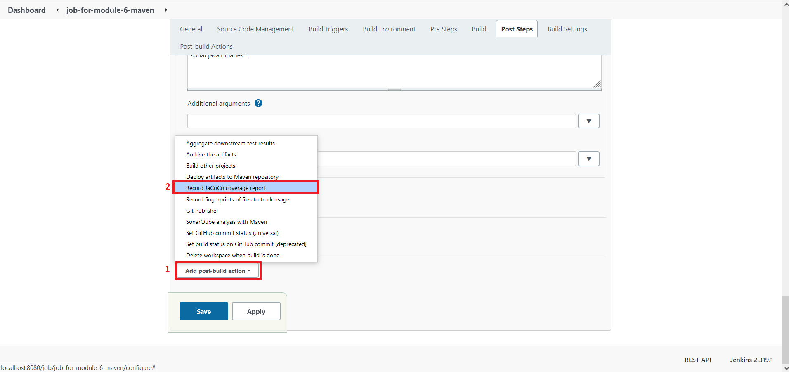

В появившейся секции оставляем всё как есть и сохраняем `Job`.

Опять запускаем нашу `Job`, ждем пока выполнится и переходим в `Job` с именем `job-for-module-6-maven`, где увидим график `Code Coverage Trend`:

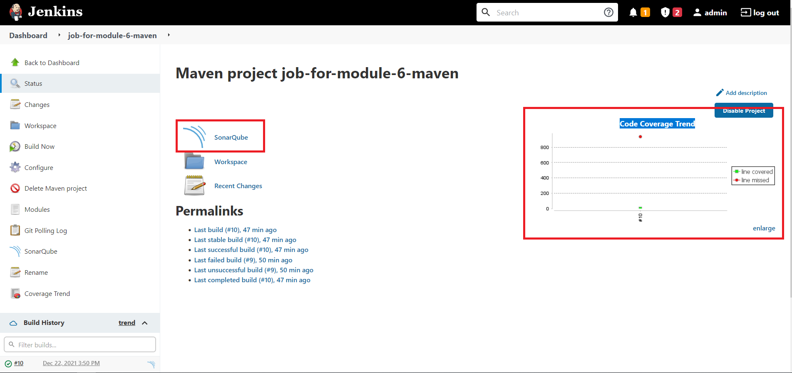

Для дополнительных сведений отчета можно нажать на график.

Ну что ж, переходим к последнему [шагу 4 - Jenkins should deploy your application (after passing SonarQube quality gate) under your local tomcat server. Please use Jenkins Tomcat Deploy plugin.](step_4.md)