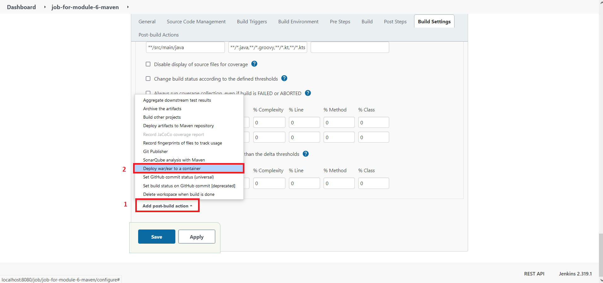
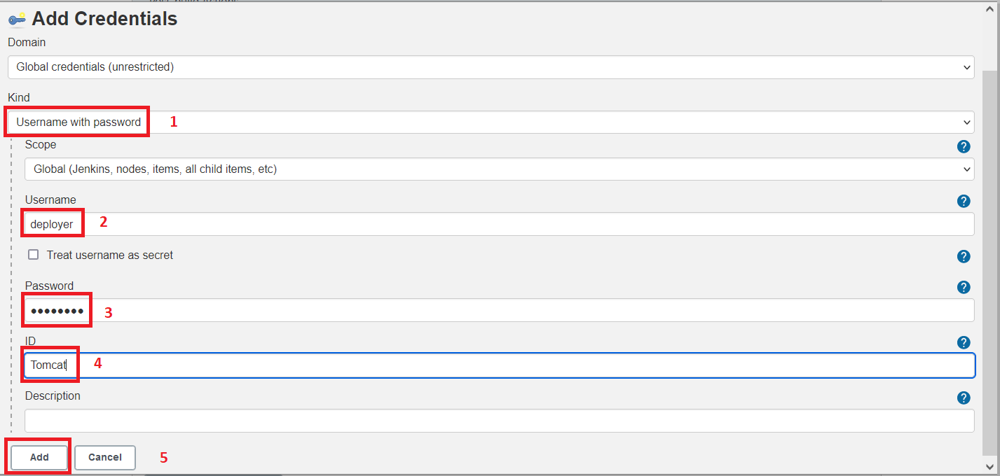
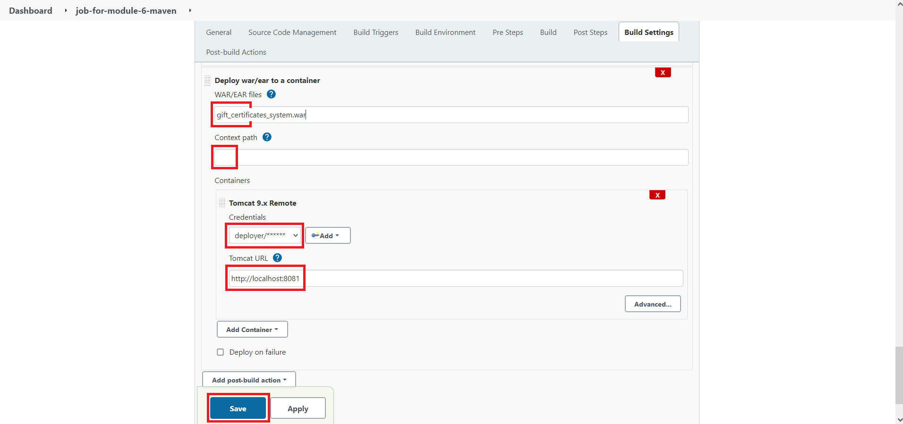
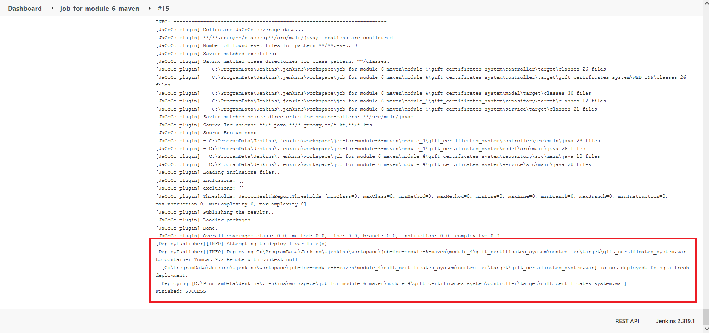
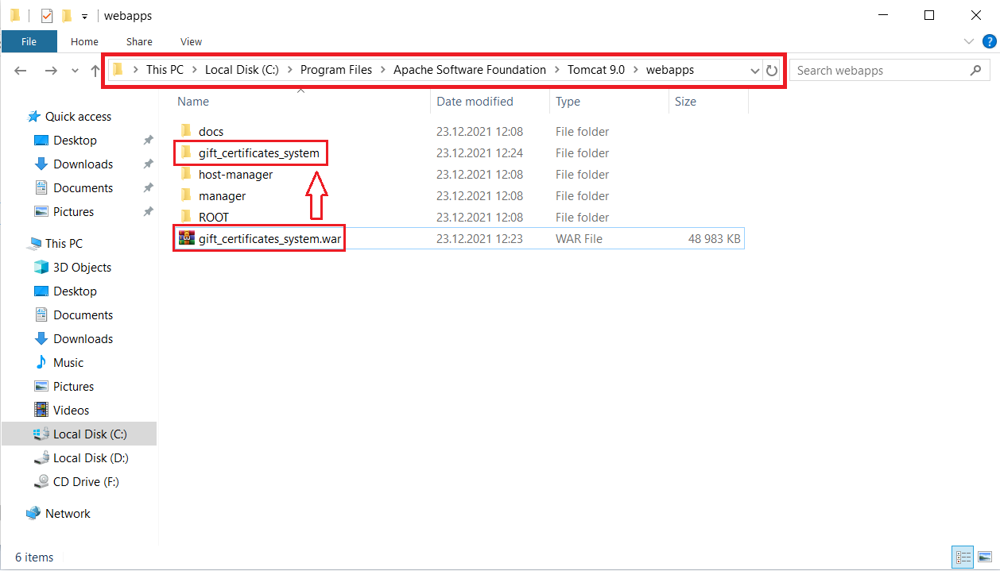
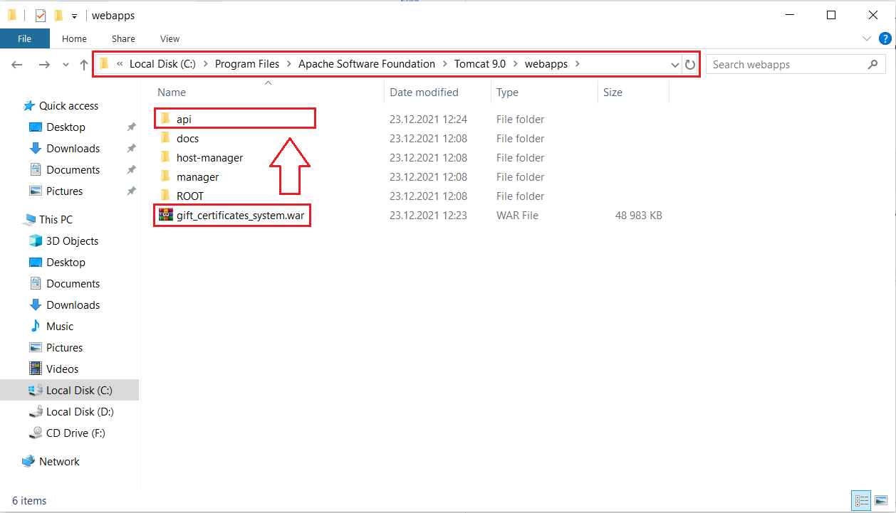

## Step 4
Текущее условие звучит как `Jenkins should deploy your application (after passing SonarQube quality gate) under your local tomcat server. Please use Jenkins Tomcat Deploy plugin.`

### Подготовка
Перед выполнением данного задания установить плагин для Jenkins под названием [Deploy to container](https://plugins.jenkins.io/deploy/).

### 1. Create a Deployable War File
Согласно [официальной документации Spring Boot](https://docs.spring.io/spring-boot/docs/current-SNAPSHOT/reference/htmlsingle/#howto-convert-an-existing-application-to-spring-boot]) первым шагом в создании развертываемого `war` файла является наследование от `SpringBootServletInitializer` и переопределение его метода настройки. Это позволяет использовать поддержку сервлетов 3.0 Spring Framework и позволяет настраивать приложение, когда оно запускается контейнером сервлетов. Как правило, вам следует обновить основной класс (`public static void main`) вашего приложения и переопределить метод `configure`:
```java
@SpringBootApplication(scanBasePackages = PackagePath.BASE)
@EnableJpaRepositories(PackagePath.REPOSITORY)
@EntityScan(PackagePath.MODEL)
public class EsmApplicationRunner extends SpringBootServletInitializer {
    public static void main(String[] args) {
        SpringApplication.run(EsmApplicationRunner.class, args);
    }

    @Override
    protected SpringApplicationBuilder configure(SpringApplicationBuilder builder) {
        return builder.sources(EsmApplicationRunner.class);
    }
}
```

Следующим шагом является изменение корневого `pom.xml` файла для указания того, чтобы на выходе мы получили не `jar`, а `war` файл:
```xml
<packaging>war</packaging>
```

Последний шаг - убедиться, что встроенный контейнер сервлетов не мешает контейнеру сервлетов (Tomcat), в котором развернут файл war. Для этого вам нужно пометить зависимость встроенного контейнера сервлета как `provided`:
```xml
<dependencies>
    <!-- ... -->
    <dependency>
        <groupId>org.springframework.boot</groupId>
        <artifactId>spring-boot-starter-tomcat</artifactId>
        <scope>provided</scope>
    </dependency>
    <!-- ... -->
</dependencies>
```

### 2. Настраиваем Tomcat
Необходимо создать учетную запись Tomcat из-под которой будет осуществляться деплой `war` приложения. Для этого необходимо:
1. Переходим по пути:
    ```text
    C:\Program Files\Apache Software Foundation\Tomcat 9.0\conf
    ```
2. Открываем файл с именем `tomcat-users.xml`
3. Внутри `<tomcat-users>` добавляем следующее:
   ```xml
   <user username="deployer" password="deployer" roles="manager-script"/>
   ```

Внутри файла `tomcat-users.xml` содержится описание, которое поможет понять суть происходящего.

### 3. Изменяем Jenkins Job

#### Узнать порт Tomcat по
Чтобы узнать порт по умолчанию для Tomcat, перейдите `C:\Program Files\Apache Software Foundation\Tomcat 9.0\conf`, откройте файл `server.xml` и найдите такие строки:
```xml
<Connector port="8080" protocol="HTTP/1.1"
               connectionTimeout="20000"
               redirectPort="8443" />
```

Я изменил данный Tomcat порт с `8080` на `8081`, так как на порту `8080` у меня работает Jenkins.

#### Изменение Job
Сейчас изменим нашу `Job`. Открываем нашу `Job` с именем `job-for-module-6-maven` и опускаемся к разделу `Post-build Actions`, где жмем кнопку `Add post-build action` → `Deploy war/ear to a container`:



1. В графу `WAR/EAR files` можно указать конкретный путь + имя  `war\jar` архива либо указать маску `**/*.war`. Так как у меня по пути находится несколько `war` файлов, я укажу тут конкретно путь и имя файла `module_4\gift_certificates_system\controller\target\gift_certificates_system.war`. 
   > Если будете писать путь, то обратите внимание, в какую сторону правильно ставить наклонную черту.
2. Графу `Context path` оставляем пустой (про это написано ниже)
3. В графу `Tomcat URL` вписываем `http://localhost:8081`
4. В графе `Containers` жмем `Add Container` и выбираем `Tomcat 9.x remote`
5. Добавляем `Credentials`:
   - `Kind` = `Username with password`
   - `Username` = `deployer`
   - `Password` = `deployer`
   - `ID` = `Tomcat`





Запускаем нашу `Job`, смотрим `Console Output` и радуемся выполненному заданию :)



#### Context path
Сейчас объясню поведение `Context path`.

Начнем с того, что путь, по которому находятся `war` файлы для развертывания на Tomcat находятся в папке `webapps` по пути:
```text
C:\Program Files\Apache Software Foundation\Tomcat 9.0\webapps
```

После того, как `Jenkins` запустит нашу `Job`, произойдет:
1. Копирование файлов из указанного репозитория в каталог Jenkins:
   ```text
   C:\ProgramData\Jenkins\.jenkins\workspace\job-for-module-6-maven
   ```
2. Затем `Maven` с помощью команды `clean package` упакует наше приложение в `war` файл, который у меня именуется как `gift_certificates_system.war`
3. Затем `Job` скопирует полученный `war` файл в каталог `Tomcat`:
   ```text
   C:\Program Files\Apache Software Foundation\Tomcat 9.0\webapps
   ```
4. И тут `gift_certificates_system.war` разархивируется в папку с именем как у архива, т.е. в `gift_certificates_system`



Если поле `Context path` оставить незаполненным, то наше приложение будет доступно по пути:
```text
http://localhost:8081/<имя-war-архива>/
```

Если в поле `Context path` вписать `api`, то наш архив `gift_certificates_system.war` распакуется в папку `api` и наше приложение будет доступно по пути:
```text
http://localhost:8081/api/
```



Конец :)